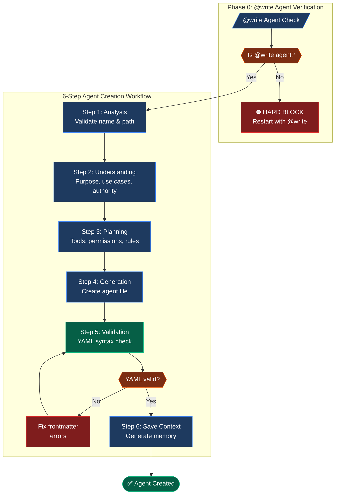

## ⚡ GATE 3 STATUS: EXEMPT (Self-Documenting Artifact)

**This command creates agent files that ARE the configuration artifact.**

| Property        | Value                                                                |
| --------------- | -------------------------------------------------------------------- |
| **Location**    | `.opencode/agent/` (project) or `~/.config/opencode/agent/` (global) |
| **Reason**      | The created file IS the agent configuration                          |
| **Spec Folder** | Optional - can track complex agent development                       |

---

# 🚨 SINGLE CONSOLIDATED PROMPT - ONE USER INTERACTION

**This workflow uses a SINGLE consolidated prompt to gather ALL required inputs in ONE user interaction.**

**Round-trip optimization:** This workflow requires only 1 user interaction.

---

## 🔒 PHASE 0: WRITE AGENT VERIFICATION [PRIORITY GATE]

**STATUS: ☐ BLOCKED** (Must pass BEFORE unified setup phase)

> **⚠️ CRITICAL:** This command REQUIRES the `@write` agent for template enforcement and quality gates.

```
EXECUTE THIS CHECK FIRST:

├─ SELF-CHECK: Are you operating as the @write agent?
│   │
│   ├─ INDICATORS that you ARE @write agent:
│   │   ├─ You were invoked with "@write" prefix
│   │   ├─ You have template-first workflow capabilities
│   │   ├─ You load templates BEFORE creating content
│   │   ├─ You validate template alignment AFTER creating
│   │
│   ├─ IF YES (all indicators present):
│   │   └─ SET STATUS: ✅ PASSED → Proceed to UNIFIED SETUP PHASE
│   │
│   └─ IF NO or UNCERTAIN:
│       │
│       ├─ ⛔ HARD BLOCK - DO NOT PROCEED
│       │
│       ├─ DISPLAY to user:
│       │   ┌────────────────────────────────────────────────────────────┐
│       │   │ ⛔ WRITE AGENT REQUIRED                                    │
│       │   │                                                            │
│       │   │ This command requires the @write agent for:                │
│       │   │   • Template-first workflow (loads before creating)          │
│       │   │   • Frontmatter validation                                 │
│       │   │   • workflows-documentation skill integration               │
│       │   │                                                            │
│       │   │ To proceed, restart with:                                  │
│       │   │   @write /create:agent [agent-name]                        │
│       │   │                                                            │
│       │   │ Reference: .opencode/agent/write.md                        │
│       │   └────────────────────────────────────────────────────────────┘
│       │
│       └─ RETURN: STATUS=FAIL ERROR="Write agent required"

⛔ HARD STOP: DO NOT proceed to UNIFIED SETUP PHASE until STATUS = ✅ PASSED
```

**Phase 0 Output:** `write_agent_verified = [yes/no]`

---

## 🔒 UNIFIED SETUP PHASE

**STATUS: ☐ BLOCKED**

```
EXECUTE THIS SINGLE CONSOLIDATED PROMPT:

1. CHECK for mode suffix in command invocation:
   ├─ ":auto" suffix detected → execution_mode = "AUTONOMOUS" (pre-set, omit Q3)
   ├─ ":confirm" suffix detected → execution_mode = "INTERACTIVE" (pre-set, omit Q3)
   └─ No suffix → execution_mode = "ASK" (include Q3 in prompt)

2. CHECK if $ARGUMENTS contains an agent name:
   ├─ IF $ARGUMENTS has content (ignoring flags like --mode, --global) → agent_name = $ARGUMENTS, omit Q0
   │   └─ VALIDATE agent name format:
   │       ├─ Must be lowercase
   │       ├─ Only letters, numbers, and hyphens allowed
   │       ├─ No uppercase, underscores, or special characters
   │       └─ IF invalid: include Q0 in prompt with error message
   └─ IF $ARGUMENTS is empty → include Q0 in prompt

3. CHECK for --mode flag:
   ├─ IF --mode primary → agent_mode = "primary", omit Q1
   ├─ IF --mode subagent → agent_mode = "subagent", omit Q1
   ├─ IF --mode all → agent_mode = "all", omit Q1
   └─ IF no --mode flag → include Q1 in prompt

4. CHECK for --global flag:
   ├─ IF --global present → is_global = true, location = "~/.config/opencode/agent/", omit Q2
   └─ IF no --global → include Q2 in prompt

5. Check if agent already exists at target location:
   $ ls -la [determined_path]/[agent_name].md 2>/dev/null
   └─ IF exists → Note for display after user answers

6. ASK user with SINGLE CONSOLIDATED prompt (include only applicable questions):

   ┌────────────────────────────────────────────────────────────────┐
   │ **Before proceeding, please answer:**                          │
   │                                                                │
   │ **Q0. Agent Name** (if not provided or invalid):               │
   │    What agent would you like to create?                        │
   │    Format: lowercase, hyphenated (e.g., review, security-audit)│
   │                                                                │
   │ **Q1. Agent Type** (if no --mode flag):                         │
   │    A) Primary - Tab cycle main assistant                       │
   │    B) Subagent - Invoked via @ mention (Recommended)           │
   │    C) Both (mode: all)                                         │
   │                                                                │
   │ **Q2. Location** (if no --global flag):                         │
   │    A) Project (.opencode/agent/) (Recommended)                 │
   │    B) Global (~/.config/opencode/agent/)                        │
   │                                                                │
   │ **Q3. Execution Mode** (if no :auto/:confirm suffix):            │
   │    A) Interactive - Confirm at each step (Recommended)          │
   │    B) Autonomous - Execute without prompts                     │
   │                                                                │
   │ **Q4. Spec Folder** (optional):                                │
   │    A) Create new spec folder                                   │
   │    B) Skip documentation (simple agent)                        │
   │                                                                │
   │ Reply with answers, e.g.: "B, A, A, B" or "review, B, A, A, B" │
   └────────────────────────────────────────────────────────────────┘

7. WAIT for user response (DO NOT PROCEED)

8. Parse response and store ALL results:
   - agent_name = [from Q0 or $ARGUMENTS]
   - agent_mode = [primary/subagent/all from --mode flag or Q1]
   - is_global = [true/false from --global flag or Q2]
   - agent_path = [derived: is_global ? "~/.config/opencode/agent/" : ".opencode/agent/"] + agent_name + ".md"
   - execution_mode = [AUTONOMOUS/INTERACTIVE from suffix or Q3]
   - spec_choice = [A/B from Q4]
   - spec_path = [if A: determine next spec folder number, if B: null]

9. Handle conditional checks:
   - IF agent already exists at agent_path:
       ├─ DISPLAY inline:
       │   ┌────────────────────────────────────────────────────────────┐
       │   │ ⚠️ Agent '[agent_name]' already exists at [path].          │
       │   │                                                            │
       │   │ A) Overwrite existing file                                  │
       │   │ B) Create with different name                              │
       │   │ C) Cancel                                                  │
       │   └────────────────────────────────────────────────────────────┘
       ├─ WAIT for user response
       └─ Process based on choice

10. Execute spec folder creation if spec_choice == A:
    ├─ Find next number: ls -d specs/[0-9]*/ | sort -n | tail -1
    ├─ Create: specs/[NNN]-[agent-name]-agent/
    └─ Store as: spec_path

11. SET STATUS: ✅ PASSED

**STOP HERE** - Wait for user to answer ALL applicable questions before continuing.

⛔ HARD STOP: DO NOT proceed until user explicitly answers
⛔ NEVER auto-create agents without user confirmation
⛔ NEVER auto-select execution mode without suffix or explicit choice
⛔ NEVER split these questions into multiple prompts
```

**Phase Output:**
- `agent_name = ________________`
- `agent_mode = ________________`
- `is_global = ________________`
- `agent_path = ________________`
- `execution_mode = ________________`
- `spec_choice = ___` | `spec_path = ________________`
- `existing_agent = [yes/no]`

---

## 📋 MODE BEHAVIORS

**AUTONOMOUS (:auto):**
- Execute all steps without approval prompts
- Only stop for errors or missing required input
- Best for: Experienced users, scripted workflows, batch operations

**INTERACTIVE (:confirm):**
- Pause at each major step for user approval
- Show preview before file creation
- Ask for confirmation on critical decisions
- Best for: New users, learning workflows, high-stakes changes

**Default:** INTERACTIVE (creation workflows benefit from confirmation)

---

## ✅ PHASE STATUS VERIFICATION (BLOCKING)

**Before continuing to the workflow, verify ALL values are set:**

| FIELD          | REQUIRED      | YOUR VALUE | SOURCE                   |
| -------------- | ------------- | ---------- | ------------------------ |
| write_verified | ✅ Yes         | ______     | Phase 0                  |
| agent_name     | ✅ Yes         | ______     | Q0 or $ARGUMENTS         |
| agent_mode     | ✅ Yes         | ______     | Q1 or --mode flag        |
| is_global      | ✅ Yes         | ______     | Q2 or --global flag      |
| agent_path     | ✅ Yes         | ______     | Derived from above       |
| execution_mode | ✅ Yes         | ______     | Suffix or Q3             |
| spec_choice    | ✅ Yes         | ______     | Q4                       |
| spec_path      | ○ Conditional | ______     | Derived if spec_choice=A |

```
VERIFICATION CHECK:
├─ ALL required fields have values?
│   ├─ YES → Proceed to "# Agent Creation Workflow" section below
│   └─ NO  → Re-prompt for missing values only
```

---

## ⚠️ VIOLATION SELF-DETECTION (BLOCKING)

**YOU ARE IN VIOLATION IF YOU:**

**Phase Violations:**
- Executed command without @write agent verification (Phase 0)
- Started reading the workflow section before all fields are set
- Asked questions in MULTIPLE separate prompts instead of ONE consolidated prompt
- Proceeded without asking user for agent name when not in $ARGUMENTS
- Auto-selected agent type without explicit user choice
- Overwrote existing agent without confirmation

**Workflow Violations (Steps 1-6):**
- Skipped understanding phase and jumped to generation
- Created agent without gathering purpose and use cases first
- Did not validate frontmatter syntax before claiming complete
- Claimed "complete" without YAML validation

**VIOLATION RECOVERY PROTOCOL:**
```
FOR PHASE VIOLATIONS:
1. STOP immediately - do not continue current action
2. STATE: "I asked questions separately instead of consolidated. Correcting now."
3. PRESENT the single consolidated prompt with ALL applicable questions
4. WAIT for user response
5. RESUME only after all fields are set

FOR WORKFLOW VIOLATIONS:
1. STOP immediately
2. STATE: "I skipped STEP [X] by [specific action]. Correcting now."
3. RETURN to the skipped step
4. COMPLETE all activities for that step
5. VERIFY outputs exist
6. MARK step ✅ in tracking table
7. CONTINUE to next step in sequence
```

---

# 📊 WORKFLOW EXECUTION - MANDATORY TRACKING

**⛔ ENFORCEMENT RULE:** Execute steps IN ORDER (1→6). Mark each step ✅ ONLY after completing ALL its activities and verifying outputs. DO NOT SKIP STEPS.

---

## WORKFLOW TRACKING

| STEP | NAME          | STATUS | REQUIRED OUTPUT               | VERIFICATION                   |
| ---- | ------------- | ------ | ----------------------------- | ------------------------------ |
| 1    | Analysis      | ☐      | agent_name, agent_path        | Name validated, path confirmed |
| 2    | Understanding | ☐      | Purpose, use cases, authority | Examples gathered              |
| 3    | Planning      | ☐      | Tools, permissions, rules     | Configuration defined          |
| 4    | Generation    | ☐      | [agent_name].md               | File created with content      |
| 5    | Validation    | ☐      | YAML syntax verified          | Frontmatter valid              |
| 6    | Save Context  | ☐      | memory/*.md (if spec folder)  | Context preserved              |

---

## WORKFLOW DIAGRAM



---

## ⛔ CRITICAL ENFORCEMENT RULES

```
STEP 2 (Understanding) REQUIREMENTS:
├─ MUST gather agent PURPOSE (what role does it fill?)
├─ MUST gather 2-3 concrete USE CASES (when invoked?)
├─ MUST define AUTHORITY (what decisions can it make?)
└─ MUST NOT proceed without user confirmation

STEP 3 (Planning) REQUIREMENTS:
├─ MUST identify TOOLS needed (read, write, edit, bash, etc.)
├─ MUST determine PERMISSIONS (allow/deny/ask for each action)
├─ MUST define BEHAVIORAL RULES (ALWAYS/NEVER/ESCALATE IF)
├─ MUST identify SKILLS to integrate (if any)
└─ MUST NOT proceed without tool/permission configuration

STEP 4 (Generation) REQUIREMENTS:
├─ MUST include valid YAML frontmatter with:
│   ├─ name (matches file name)
│   ├─ description (one-line)
│   ├─ mode (primary/subagent/all)
│   ├─ temperature (default: 0.1)
│   ├─ tools (object with true/false)
│   └─ permission (object with allow/deny/ask)
├─ MUST include markdown body with:
│   ├─ Title and intro
│   ├─ Core workflow section
│   ├─ Domain-specific sections
│   ├─ Anti-patterns section
│   └─ Related resources section
└─ MUST NOT leave placeholder content

STEP 5 (Validation) REQUIREMENTS:
├─ MUST verify YAML frontmatter parses correctly
├─ MUST check required fields present (name, description)
├─ MUST verify mode is valid (primary/subagent/all)
└─ MUST NOT claim "complete" without validation pass
```

---

# Agent Creation Workflow

Create a complete OpenCode agent with proper YAML frontmatter, tool permissions, behavioral rules, and markdown documentation.

---

```yaml
role: Expert Agent Creator using workflows-documentation skill
purpose: Create production-ready OpenCode agents (primary or subagent)
action: Guide agent creation from understanding through validation

operating_mode:
  workflow: sequential_6_step
  workflow_compliance: MANDATORY
  workflow_execution: interactive
  approvals: step_by_step
  tracking: progressive_task_checklists
  validation: yaml_frontmatter_check
```

---

## 1. 🎯 PURPOSE

Create a complete, production-ready OpenCode agent following the 6-step workflow. The workflow ensures understanding before implementation, validates YAML frontmatter syntax, and produces agents that integrate seamlessly with OpenCode's agent system.

---

## 2. 📝 CONTRACT

**Inputs:** `$ARGUMENTS` — Agent name with optional --mode and --global flags
**Outputs:** Agent markdown file at specified location + `STATUS=<OK|FAIL|CANCELLED>`

### User Input

```text
$ARGUMENTS
```

---

## 3. ⚡ INSTRUCTIONS

### Step 4: Verify All Phases Passed

Confirm you have these values from the unified setup phase:
- `agent_name` from Q0 or $ARGUMENTS
- `agent_mode` from Q1 or --mode flag (primary/subagent/all)
- `agent_path` derived from Q2 or --global flag
- `execution_mode` from suffix or Q3
- `spec_path` from Q4 (or null if skipped)

**If ANY value is missing, STOP and return to the UNIFIED SETUP PHASE.**

### Step 5: Execute Workflow

Execute the 6-step workflow:

**STEP 1: Analysis**
- Validate agent name format (lowercase, hyphenated)
- Confirm output location
- Check for existing agent (handled in unified setup)

**STEP 2: Understanding**
Ask user these questions (one at a time):

1. **Purpose**: What is the agent's purpose? What specific role will it fill?
   (e.g., "Code review specialist", "Security auditor", "Test automation")

2. **Use Cases**: Give me 2-3 concrete examples of when this agent would be invoked.
   (e.g., "When user asks to review a PR", "When security scan is needed")

3. **Authority**: What is this agent responsible for? What decisions can it make?
   (e.g., "Approve/reject code changes", "Flag security issues")

**STEP 3: Planning**
Based on understanding, determine:

1. **Permissions** (v1.1.1+ unified format): Which tools and actions are allowed?
   - read: allow/deny - Examine files
   - write: allow/deny - Create files
   - edit: allow/deny/ask - Modify files
   - bash: allow/deny/ask - Run commands (can use patterns)
   - grep: allow/deny - Search content
   - glob: allow/deny - Find files
   - webfetch: allow/deny/ask - Fetch URLs
   - narsil: allow/deny - Semantic + structural code analysis
   - memory: allow/deny - Spec Kit Memory
   - chrome_devtools: allow/deny - Browser debugging
   - external_directory: allow/deny - Access files outside project

2. **Behavioral Rules**:
   - ✅ ALWAYS: What must this agent always do?
   - ❌ NEVER: What must this agent never do?
   - ⚠️ ESCALATE IF: When should it ask for help?

3. **Skills Integration**: Which skills should this agent invoke?

**STEP 4: Generation**
Create the agent file with this structure (v1.1.1+ format):

```markdown
---
name: [agent_name]
description: "[One-line description based on purpose]"
mode: [agent_mode]
temperature: 0.1
permission:
  read: [allow/deny]
  write: [allow/deny]
  edit: [allow/deny/ask]
  bash: [allow/deny/ask]
  grep: [allow/deny]
  glob: [allow/deny]
  webfetch: [allow/deny/ask]
  narsil: [allow/deny]
  memory: [allow/deny]
  chrome_devtools: [allow/deny]
  external_directory: [allow/deny]
---

# [Agent Title]

[1-2 sentence intro based on purpose and authority]

---

## 1. 🔄 CORE WORKFLOW

[Numbered steps based on use cases]

---

## 2. 📋 [DOMAIN SECTION]

[Content based on purpose - e.g., "Code Review Standards" for a review agent]

---

## 3. 🚫 ANTI-PATTERNS

❌ **Never [rule from planning]**
- [Reason]

❌ **Never [rule from planning]**
- [Reason]

---

## 4. 🔗 RELATED RESOURCES

- [Skills identified in planning]
- [Other relevant resources]
```

**STEP 5: Validation**
Run YAML validation:

```bash
python3 -c "import yaml; yaml.safe_load(open('[agent_path]').read().split('---')[1])"
```

Verify:
- [ ] YAML parses without errors
- [ ] `name` field matches file name
- [ ] `description` is present and single-line
- [ ] `mode` is one of: primary, subagent, all
- [ ] `permission` object uses v1.1.1+ format (allow/deny/ask values)
- [ ] No deprecated `tools` object present

**STEP 6: Save Context (if spec folder used)**
If spec_path is not null:
```bash
node .opencode/skill/system-spec-kit/scripts/memory/generate-context.js [spec_path]
```

---

## 4. 📌 REFERENCE

### Agent Mode Reference

| Mode     | Tab Cycle | @ Mention | Automatic Invocation | Use Case            |
| -------- | --------- | --------- | -------------------- | ------------------- |
| primary  | ✅         | ✅         | ❌                    | Main assistant      |
| subagent | ❌         | ✅         | ✅                    | Specialized tasks   |
| all      | ✅         | ✅         | ✅                    | Maximum flexibility |

### Tool Reference

| Tool            | Purpose                             | Default |
| --------------- | ----------------------------------- | ------- |
| read            | Read files                          | true    |
| write           | Create files                        | true    |
| edit            | Modify files                        | true    |
| bash            | Execute commands                    | true    |
| grep            | Search content                      | true    |
| glob            | Find files                          | true    |
| webfetch        | Fetch URLs                          | false   |
| narsil          | Semantic + structural code analysis | true    |
| memory          | Spec Kit Memory                     | true    |
| chrome_devtools | Browser debugging                   | false   |

### Permission Reference

| Permission | Values         | Description                            |
| ---------- | -------------- | -------------------------------------- |
| edit       | allow/deny/ask | File modification permission           |
| bash       | allow/deny/ask | Command execution (can be per-command) |
| webfetch   | allow/deny/ask | URL fetching permission                |

---

## 5. 🔍 EXAMPLES

**Example 1: Code Review Subagent**
```
/create:agent review --mode subagent
```
→ Creates `.opencode/agent/review.md`
→ Invoked via `@review` or automatically by primary agents

**Example 2: Security Audit Primary Agent**
```
/create:agent security-audit --mode primary
```
→ Creates `.opencode/agent/security-audit.md`
→ Appears in Tab cycle

**Example 3: Global Documentation Agent**
```
/create:agent docs-writer --mode subagent --global
```
→ Creates `~/.config/opencode/agent/docs-writer.md`
→ Available across all projects

**Example 4: Prompted Creation**
```
/create:agent
```
→ Prompts: Single consolidated prompt with Q0-Q4
→ Interactive workflow guides through all decisions

**Example 5: Auto mode (no prompts)**
```
/create:agent review --mode subagent :auto
```
→ Creates agent without approval prompts, only stops for errors

**Example 6: Confirm mode (step-by-step approval)**
```
/create:agent security-audit --mode primary :confirm
```
→ Pauses at each step for user confirmation

---

## 6. 🔗 COMMAND CHAIN

This command creates standalone agents:

```
/create:agent → [Test with @agent-name]
```

**Related commands:**
- Test agent: `@[agent-name] [task]`
- Edit agent: `.opencode/agent/[agent-name].md`

---

## 7. 📌 NEXT STEPS

After agent creation completes, suggest relevant next steps:

| Condition            | Suggested Command                      | Reason                          |
| -------------------- | -------------------------------------- | ------------------------------- |
| Agent created        | Test with `@[agent-name]`              | Verify agent works as expected  |
| Need to modify       | Edit `.opencode/agent/[agent-name].md` | Adjust behavior or permissions  |
| Create another agent | `/create:agent [name]`                 | Build related agent             |
| Want to save context | `/memory:save [spec-folder-path]`      | Preserve agent design decisions |

**ALWAYS** end with: "What would you like to do next?"
