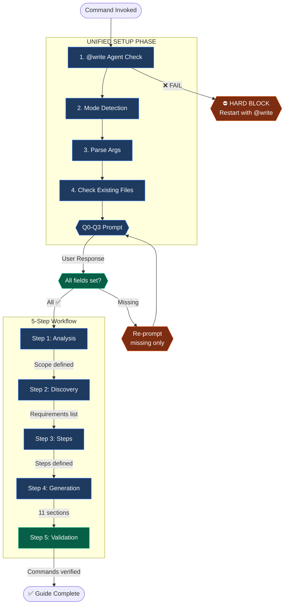

## ⚡ GATE 3 STATUS: EXEMPT (Self-Documenting Artifact)

**This command creates documentation files that ARE the documentation artifact.**

| Property        | Value                                                       |
| --------------- | ----------------------------------------------------------- |
| **Location**    | User-specified path (`install_guides/` or target directory) |
| **Reason**      | The created file IS the documentation                       |
| **Spec Folder** | Not required - the guide/README serves as its own spec      |

---

# 🚨 SINGLE CONSOLIDATED PROMPT - ONE USER INTERACTION

**This workflow uses a SINGLE consolidated prompt to gather ALL required inputs in ONE user interaction.**

**Round-trip optimization:** This workflow requires only 1 user interaction.

---

## 🔒 UNIFIED SETUP PHASE

**STATUS: ☐ BLOCKED**

```
EXECUTE THIS SINGLE CONSOLIDATED PROMPT:

1. CHECK Phase 0: @write agent verification (automatic)
   ├─ SELF-CHECK: Are you operating as the @write agent?
   │   ├─ INDICATORS that you ARE @write agent:
   │   │   ├─ You were invoked with "@write" prefix
   │   │   ├─ You have template-first workflow capabilities
   │   │   ├─ You load templates BEFORE creating content
   │   │   ├─ You validate template alignment AFTER creating
   │   │
   │   ├─ IF YES (all indicators present):
   │   │   └─ write_agent_verified = TRUE → Continue to step 2
   │   │
   │   └─ IF NO or UNCERTAIN:
   │       ├─ ⛔ HARD BLOCK - DO NOT PROCEED
   │       ├─ DISPLAY to user:
   │       │   ┌────────────────────────────────────────────────────────────┐
   │       │   │ ⛔ WRITE AGENT REQUIRED                                    │
   │       │   │                                                            │
   │       │   │ This command requires the @write agent for:                │
   │       │   │   • Template-first workflow (loads before creating)          │
   │       │   │   • DQI scoring (target: 90+ Excellent)                    │
   │       │   │   • workflows-documentation skill integration               │
   │       │   │                                                            │
   │       │   │ To proceed, restart with:                                  │
   │       │   │   @write /create:install_guide [project-name]              │
   │       │   │                                                            │
   │       │   │ Reference: .opencode/agent/write.md                        │
   │       │   └────────────────────────────────────────────────────────────┘
   │       └─ RETURN: STATUS=FAIL ERROR="Write agent required"

2. CHECK for mode suffix in $ARGUMENTS or command invocation:
   ├─ ":auto" suffix detected → execution_mode = "AUTONOMOUS" (pre-set, omit Q3)
   ├─ ":confirm" suffix detected → execution_mode = "INTERACTIVE" (pre-set, omit Q3)
   └─ No suffix → execution_mode = "ASK" (include Q3 in prompt)

3. CHECK if $ARGUMENTS contains a project name:
   ├─ IF $ARGUMENTS has content (ignoring flags/suffixes) → project_name = $ARGUMENTS, omit Q0
   └─ IF $ARGUMENTS is empty → include Q0 in prompt

4. CHECK for --platforms flag in $ARGUMENTS:
   ├─ IF --platforms flag present with valid values → platforms = [values], omit Q1
   └─ IF no --platforms flag → include Q1 in prompt

5. Check for existing installation guides:
   $ ls -la ./install_guides/*.md ./INSTALL.md ./docs/INSTALL.md 2>/dev/null
   - Will inform conflict handling in Q2 if files exist

6. ASK user with SINGLE CONSOLIDATED prompt (include only applicable questions):

   ┌────────────────────────────────────────────────────────────────┐
   │ **Before proceeding, please answer:**                          │
   │                                                                │
   │ **Q0. Project Name** (if not provided in command):             │
   │    What project/tool needs an installation guide?              │
   │                                                                │
   │ **Q1. Target Platforms** (required):                           │
   │    A) All platforms (macOS, Linux, Windows, Docker)            │
   │    B) macOS only                                               │
   │    C) Linux only                                               │
   │    D) Custom (specify: macos,linux,windows,docker)             │
   │                                                                │
   │ **Q2. Output Location** (required):                            │
   │    A) install_guides/[Type] - [Name].md (Recommended)          │
   │    B) INSTALL.md at project root                               │
   │    C) docs/INSTALL.md                                          │
   │    D) Custom path (specify)                                    │
   │    [If existing file found: E) Overwrite | F) Merge | G) Cancel]│
   │                                                                │
   │ **Q3. Execution Mode** (if no :auto/:confirm suffix):            │
   │    A) Interactive - Confirm at each step (Recommended)          │
   │    B) Autonomous - Execute without prompts                     │
   │                                                                │
   │ Reply with answers, e.g.: "A, A, A" or "my-tool, A, A, A"      │
   └────────────────────────────────────────────────────────────────┘

7. WAIT for user response (DO NOT PROCEED)

8. Parse response and store ALL results:
   - project_name = [from Q0 or $ARGUMENTS]
   - platforms = [from Q1 or --platforms flag: all/macos/linux/windows/docker]
   - output_path = [derived from Q2 choice]
   - existing_file = [yes/no based on check]
   - conflict_resolution = [if existing: overwrite/merge/cancel]
   - execution_mode = [AUTONOMOUS/INTERACTIVE from suffix or Q3]

9. IF output location has conflict AND conflict_resolution not set:
   - Handle inline based on Q2 response (E/F/G options)

10. SET STATUS: ✅ PASSED

**STOP HERE** - Wait for user to answer ALL applicable questions before continuing.

⛔ HARD STOP: DO NOT proceed until user explicitly answers
⛔ NEVER infer project from context
⛔ NEVER assume platforms without confirmation
⛔ NEVER split these questions into multiple prompts
```

**Phase Output:**
- `write_agent_verified = ________________`
- `project_name = ________________`
- `platforms = ________________`
- `output_path = ________________`
- `existing_file = ________________`
- `execution_mode = ________________`

---

## 📋 MODE BEHAVIORS

**AUTONOMOUS (:auto):**
- Execute all steps without approval prompts
- Only stop for errors or missing required input
- Best for: Experienced users, scripted workflows, batch operations

**INTERACTIVE (:confirm):**
- Pause at each major step for user approval
- Show preview before file creation
- Ask for confirmation on critical decisions
- Best for: New users, learning workflows, high-stakes changes

**Default:** INTERACTIVE (creation workflows benefit from confirmation)

---

## ✅ PHASE STATUS VERIFICATION (BLOCKING)

**Before continuing to the workflow, verify ALL values are set:**

| FIELD                | REQUIRED | YOUR VALUE | SOURCE                 |
| -------------------- | -------- | ---------- | ---------------------- |
| write_agent_verified | ✅ Yes    | ______     | Automatic check        |
| project_name         | ✅ Yes    | ______     | Q0 or $ARGUMENTS       |
| platforms            | ✅ Yes    | ______     | Q1 or --platforms flag |
| output_path          | ✅ Yes    | ______     | Derived from Q2        |
| existing_file        | ✅ Yes    | ______     | Automatic check        |
| execution_mode       | ✅ Yes    | ______     | Suffix or Q3           |

```
VERIFICATION CHECK:
├─ ALL required fields have values?
│   ├─ YES → Proceed to "# Installation Guide Creation Workflow" section below
│   └─ NO  → Re-prompt for missing values only
```

---

## ⚠️ VIOLATION SELF-DETECTION (BLOCKING)

**YOU ARE IN VIOLATION IF YOU:**

**Phase Violations:**
- Executed command without @write agent verification
- Started reading the workflow section before all fields are set
- Asked questions in MULTIPLE separate prompts instead of ONE consolidated prompt
- Proceeded without explicit project name when not in $ARGUMENTS
- Inferred project from context instead of explicit user input
- Assumed platforms without confirmation
- Overwrote existing file without user choice

**Workflow Violations (Steps 1-5):**
- Skipped requirements discovery and jumped to generation
- Generated guide without AI-First section
- Did not include all 11 sections (9 required + 2 optional)
- Claimed "complete" without validation checklist

**VIOLATION RECOVERY PROTOCOL:**
```
FOR PHASE VIOLATIONS:
1. STOP immediately - do not continue current action
2. STATE: "I asked questions separately instead of consolidated. Correcting now."
3. PRESENT the single consolidated prompt with ALL applicable questions
4. WAIT for user response
5. RESUME only after all fields are set

FOR WORKFLOW VIOLATIONS:
1. STOP immediately
2. STATE: "I violated STEP [X] by [specific action]. Correcting now."
3. RETURN to the violated step
4. COMPLETE the step properly
5. RESUME only after step passes
```

---

# 📊 WORKFLOW EXECUTION - MANDATORY TRACKING

**⛔ ENFORCEMENT RULE:** Execute steps IN ORDER (1→5). Mark each step ✅ ONLY after completing ALL its activities and verifying outputs. DO NOT SKIP STEPS.

---

## WORKFLOW TRACKING

| STEP | NAME       | STATUS | REQUIRED OUTPUT   | VERIFICATION                |
| ---- | ---------- | ------ | ----------------- | --------------------------- |
| 1    | Analysis   | ☐      | Scope defined     | Project/platforms confirmed |
| 2    | Discovery  | ☐      | Requirements list | Prerequisites identified    |
| 3    | Steps      | ☐      | Step-by-step plan | Installation steps defined  |
| 4    | Generation | ☐      | Complete guide    | All 11 sections included    |
| 5    | Validation | ☐      | Validated guide   | Commands verified           |

---

## 📊 WORKFLOW VISUALIZATION



---

## ⛔ CRITICAL ENFORCEMENT RULES

```
STEP 2 (Discovery) REQUIREMENTS:
├─ MUST identify all prerequisites
├─ MUST determine project type (MCP/CLI/PLUGIN/SDK/SERVICE)
├─ MUST gather platform-specific requirements
└─ MUST NOT proceed without clear requirements list

STEP 4 (Generation) REQUIREMENTS:
├─ MUST include AI-First prompt section
├─ MUST include ALL 11 sections (9 required + 2 optional)
├─ MUST add platform-specific configuration
├─ MUST include troubleshooting section
└─ MUST NOT skip any required section

STEP 5 (Validation) REQUIREMENTS:
├─ MUST verify all commands are accurate
├─ MUST check all platforms covered
├─ MUST validate AI-First prompt completeness
└─ MUST NOT claim "complete" without validation checklist
```

---

# Installation Guide Creation Workflow

Create a comprehensive AI-first installation guide with clear prerequisites, step-by-step instructions, and troubleshooting for common issues. Every guide starts with a copy-paste AI prompt.

---

```yaml
role: Expert Installation Guide Creator using workflows-documentation skill
purpose: Create comprehensive multi-platform AI-first installation documentation
action: Generate step-by-step setup instructions with AI-assisted install prompt

operating_mode:
  workflow: sequential_5_step
  workflow_compliance: MANDATORY
  workflow_execution: interactive
  approvals: step_by_step
```

---

## 1. 🎯 PURPOSE

Create a comprehensive AI-first installation guide following the pattern in `install_guides/`. The guide includes a copy-paste AI prompt for assisted installation, clear prerequisites, platform-specific commands, and thorough troubleshooting.

---

## 2. 📝 CONTRACT

**Inputs:** `$ARGUMENTS` — Project name with optional --platforms flag
**Outputs:** Installation guide at specified location + `STATUS=<OK|FAIL|CANCELLED>`

### User Input

```text
$ARGUMENTS
```

---

## 3. ⚡ INSTRUCTIONS

### Step 4: Verify All Fields Set

Confirm you have these values from the unified setup phase:
- `write_agent_verified` from automatic check
- `project_name` from Q0 or $ARGUMENTS
- `platforms` from Q1 or --platforms flag (default: "all")
- `output_path` derived from Q2
- `existing_file` from automatic check
- `execution_mode` from suffix or Q3

**If ANY field is missing, STOP and return to the UNIFIED SETUP PHASE section.**

### Step 5: Load & Execute Workflow

Load and execute the workflow definition:

```
.opencode/command/create/assets/create_install_guide.yaml
```

The YAML file contains:
- Detailed step-by-step activities
- Guide type prefixes (MCP/CLI/PLUGIN/SDK/SERVICE)
- Platform configurations
- AI-First template and full guide template
- Checkpoint prompts and options
- Error recovery procedures
- Validation requirements
- Completion report template

Execute all 5 steps in sequence following the workflow definition.

---

## 4. 📌 REFERENCE (See YAML for Details)

| Section             | Location in YAML                |
| ------------------- | ------------------------------- |
| Type Prefixes       | `notes.type_prefix_conventions` |
| Required Sections   | `notes.required_sections`       |
| AI-First Philosophy | `notes.ai_first_philosophy`     |
| Failure Recovery    | `failure_recovery`              |
| Completion Report   | `completion_report_template`    |

**Reference Guides:**
- `.opencode/install_guides/MCP/MCP - Code Mode.md`
- `.opencode/install_guides/MCP/MCP - Spec Kit Memory.md`
- `.opencode/install_guides/MCP/MCP - Chrome Dev Tools.md`

---

## 5. 🔍 EXAMPLES

**Example 1: MCP Server Guide**
```
/documentation:create_install_guide semantic-search-mcp
```
→ Creates `install_guides/MCP/MCP - Semantic Search.md`

**Example 2: CLI Tool Guide**
```
/documentation:create_install_guide chrome-devtools-cli --platforms macos,linux
```
→ Creates `install_guides/CLI - Chrome DevTools.md`

**Example 3: Plugin Guide**
```
/documentation:create_install_guide antigravity-auth
```
→ Creates `install_guides/PLUGIN - Antigravity Auth.md`

**Example 4: Auto mode (no prompts)**
```
/create:install_guide semantic-search-mcp :auto
```
→ Creates install guide without approval prompts, only stops for errors

**Example 5: Confirm mode (step-by-step approval)**
```
/create:install_guide chrome-devtools-cli --platforms macos,linux :confirm
```
→ Pauses at each step for user confirmation

---

## 6. 🔗 COMMAND CHAIN

This command creates standalone documentation:

```
/create:install_guide → [Verify guide works]
```

**Related commands:**
- Create README: `/create:folder_readme [path]`

---

## 7. 📌 NEXT STEPS

After install guide creation completes, suggest relevant next steps:

| Condition            | Suggested Command                 | Reason                         |
| -------------------- | --------------------------------- | ------------------------------ |
| Guide created        | Test AI-First prompt              | Verify installation works      |
| Need README          | `/create:folder_readme [path]`    | Add project README             |
| Create another guide | `/create:install_guide [project]` | Document related tool          |
| Want to save context | `/memory:save [spec-folder-path]` | Preserve documentation context |

**ALWAYS** end with: "What would you like to do next?"
