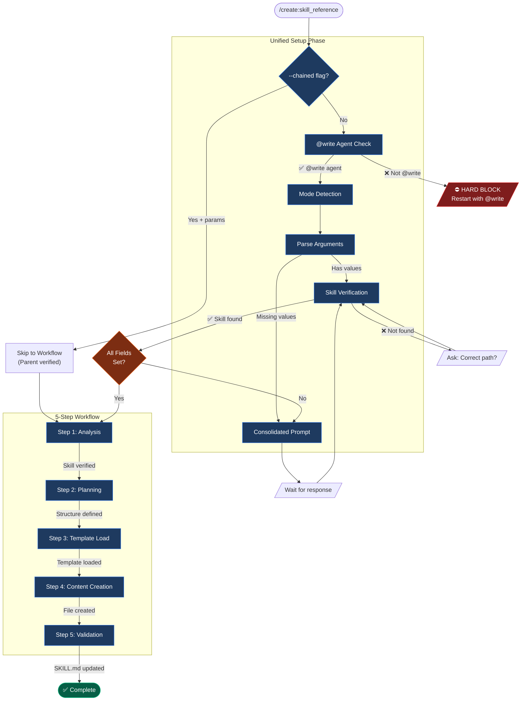

## ⚡ GATE 3 STATUS: EXEMPT (Predefined Location)

**This command creates files at a predefined location and is EXEMPT from the spec folder question.**

| Property        | Value                                                                                |
| --------------- | ------------------------------------------------------------------------------------ |
| **Location**    | `.opencode/skill/[skill-name]/references/` or `.opencode/skill/[skill-name]/assets/` |
| **Reason**      | Skill-internal files, not project documentation                                      |
| **Alternative** | Use `/create:skill` for full skill creation with spec folder                         |

---

# 🚨 SINGLE CONSOLIDATED PROMPT - ONE USER INTERACTION

**This workflow uses a SINGLE consolidated prompt to gather ALL required inputs in ONE user interaction.**

**Round-trip optimization:** This workflow requires only 1 user interaction (0 if --chained).

**⚡ CHAINED EXECUTION MODE:** If invoked with `--chained` flag, skip to workflow with provided parameters.

---

## 🔒 UNIFIED SETUP PHASE

**STATUS: ☐ BLOCKED / ⏭️ N/A if chained**

```
EXECUTE THIS SINGLE SETUP PHASE:

1. CHECK for --chained flag FIRST (PRIORITY):
   ├─ IF invoked with --chained flag OR called from skill.md Step 8:
   │   │
   │   ├─ VERIFY parent workflow provided:
   │   │   ├─ skill_name (from parent)
   │   │   ├─ skill_path (from parent - already verified)
   │   │   ├─ reference_type (from parent selection)
   │   │   ├─ execution_mode (inherited from parent)
   │   │
   │   ├─ IF all parameters present:
   │   │   ├─ SET write_agent_verified = "skipped-chained"
   │   │   ├─ SET STATUS: ⏭️ N/A (parent verified)
   │   │   └─ SKIP directly to "# Reference Creation" workflow
   │   │
   │   └─ IF parameters missing:
   │       └─ FALL THROUGH to step 2 (normal execution)
   │
   └─ IF NOT chained:
       └─ CONTINUE to step 2

2. CHECK Phase 0: @write Agent Verification (automatic):
   │
   ├─ SELF-CHECK: Are you operating as the @write agent?
   │   │
   │   ├─ INDICATORS that you ARE @write agent:
   │   │   ├─ You were invoked with "@write" prefix
   │   │   ├─ You have template-first workflow capabilities
   │   │   ├─ You load templates BEFORE creating content
   │   │
   │   ├─ IF YES (all indicators present):
   │   │   └─ SET write_agent_verified = "yes" → Continue to step 3
   │   │
   │   └─ IF NO or UNCERTAIN:
   │       │
   │       ├─ ⛔ HARD BLOCK - DO NOT PROCEED
   │       │
   │       ├─ DISPLAY to user:
   │       │   ┌────────────────────────────────────────────────────────────┐
   │       │   │ ⛔ WRITE AGENT REQUIRED                                    │
   │       │   │                                                            │
   │       │   │ This command requires the @write agent for:                │
   │       │   │   • Template-first workflow                                  │
   │       │   │   • DQI scoring                                            │
   │       │   │   • workflows-documentation skill integration               │
   │       │   │                                                            │
   │       │   │ To proceed, restart with:                                  │
   │       │   │   @write /create:skill_reference [args]                    │
   │       │   │                                                            │
   │       │   │ Reference: .opencode/agent/write.md                        │
   │       │   └────────────────────────────────────────────────────────────┘
   │       │
   │       └─ RETURN: STATUS=FAIL ERROR="Write agent required"

3. CHECK for mode suffix in $ARGUMENTS or command invocation:
   ├─ ":auto" suffix detected → execution_mode = "AUTONOMOUS" (pre-set, omit Q2)
   ├─ ":confirm" suffix detected → execution_mode = "INTERACTIVE" (pre-set, omit Q2)
   └─ No suffix → execution_mode = "ASK" (include Q2 in prompt)

4. CHECK if $ARGUMENTS contains skill name and reference type:
   ├─ Parse first argument as: skill_name (if present, omit Q0)
   ├─ Parse second argument as: reference_type (if present AND valid, omit Q1)
   │   └─ Valid types: workflow, patterns, debugging, tools, quick_ref
   └─ IF either missing or invalid → include in prompt

5. List available skills:
   $ ls .opencode/skill/*/SKILL.md 2>/dev/null | sed 's|.*/skill/||;s|/SKILL.md||'

6. ASK user with SINGLE CONSOLIDATED prompt (include only applicable questions):

   ┌────────────────────────────────────────────────────────────────┐
   │ **Before proceeding, please answer:**                          │
   │                                                                │
   │ **Q0. Skill Name** (if not provided in command):               │
   │    Which existing skill needs a reference file?                 │
   │    Available: [list from ls command]                           │
   │                                                                │
   │ **Q1. Reference Type** (if not provided or invalid):           │
   │    A) Workflow - Multi-phase processes                          │
   │    B) Patterns - Code patterns library                         │
   │    C) Debugging - Troubleshooting guide                        │
   │    D) Tools - External tool integration                        │
   │    E) Quick_ref - Commands/shortcuts                           │
   │                                                                │
   │ **Q2. Execution Mode** (if no :auto/:confirm suffix):            │
   │    A) Interactive - Confirm at each step (Recommended)          │
   │    B) Autonomous - Execute without prompts                     │
   │                                                                │
   │ Reply with answers, e.g.: "A, A" or "my-skill, A, A"           │
   └────────────────────────────────────────────────────────────────┘

7. WAIT for user response (DO NOT PROCEED)

8. Parse response and store ALL results:
   - skill_name = [from Q0 or $ARGUMENTS]
   - reference_type = [from Q1 or $ARGUMENTS: workflow/patterns/debugging/tools/quick_ref]
   - execution_mode = [AUTONOMOUS/INTERACTIVE from suffix or Q2]

9. VERIFY skill exists (inline check):
   │
   ├─ Run: ls -d .opencode/skill/[skill_name] 2>/dev/null
   │
   ├─ IF skill found:
   │   ├─ Store path as: skill_path
   │   ├─ Verify SKILL.md exists
   │   └─ Check for existing references/ directory
   │
   └─ IF skill NOT found:
       │
       ├─ DISPLAY:
       │   ┌────────────────────────────────────────────────────────────┐
       │   │ "Skill '[skill_name]' not found at expected location."     │
       │   │                                                            │
       │   │ A) Provide correct skill name                              │
       │   │ B) Provide full path to skill                              │
       │   │ C) Create new skill first (/create:skill)                   │
       │   └────────────────────────────────────────────────────────────┘
       │
       └─ WAIT for response and process based on choice

10. SET STATUS: ✅ PASSED

**STOP HERE** - Wait for user to answer ALL applicable questions before continuing.

⛔ HARD STOP: DO NOT proceed until STATUS = ✅ PASSED
⛔ NEVER infer skill name from context or conversation history
⛔ NEVER assume reference type without explicit input
⛔ NEVER create references for non-existent skills
⛔ NEVER split these questions into multiple prompts
```

**Phase Output:**
- `write_agent_verified = ________________`
- `skill_name = ________________`
- `reference_type = ________________`
- `execution_mode = ________________`
- `skill_path = ________________`

---

## 📋 MODE BEHAVIORS

**AUTONOMOUS (:auto):**
- Execute all steps without approval prompts
- Only stop for errors or missing required input
- Best for: Experienced users, scripted workflows, batch operations

**INTERACTIVE (:confirm):**
- Pause at each major step for user approval
- Show preview before file creation
- Ask for confirmation on critical decisions
- Best for: New users, learning workflows, high-stakes changes

**Default:** INTERACTIVE (creation workflows benefit from confirmation)

---

## ✅ PHASE STATUS VERIFICATION (BLOCKING)

**Before continuing to the workflow, verify ALL values are set:**

| FIELD                | REQUIRED | YOUR VALUE | SOURCE                     |
| -------------------- | -------- | ---------- | -------------------------- |
| write_agent_verified | ✅ Yes    | ______     | Step 1 (chained) or Step 2 |
| skill_name           | ✅ Yes    | ______     | Q0 or $ARGUMENTS           |
| reference_type       | ✅ Yes    | ______     | Q1 or $ARGUMENTS           |
| execution_mode       | ✅ Yes    | ______     | Suffix or Q2               |
| skill_path           | ✅ Yes    | ______     | Step 9 verification        |

```
VERIFICATION CHECK:
├─ ALL required fields have values?
│   ├─ YES → Proceed to "# Reference Creation" section below
│   └─ NO  → Re-prompt for missing values only
```

---

## ⚠️ VIOLATION SELF-DETECTION (BLOCKING)

**YOU ARE IN VIOLATION IF YOU:**

- Executed command without @write agent verification when not chained
- Started reading the workflow section before all fields are set
- Proceeded without both skill name AND reference type
- Asked questions in MULTIPLE separate prompts instead of ONE consolidated prompt
- Attempted to create reference for non-existent skill
- Inferred inputs from context instead of explicit user input
- Claimed chained mode without valid parent workflow parameters

**VIOLATION RECOVERY PROTOCOL:**
```
1. STOP immediately
2. STATE: "I violated the UNIFIED SETUP PHASE by [specific action]. Correcting now."
3. PRESENT the single consolidated prompt with ALL applicable questions
4. WAIT for user response
5. RESUME only after all fields are set
```

---

# 📊 WORKFLOW EXECUTION - MANDATORY TRACKING

**⛔ ENFORCEMENT RULE:** Execute steps IN ORDER (1→5). Mark each step ✅ ONLY after completing ALL its activities and verifying outputs. DO NOT SKIP STEPS.

---

## WORKFLOW TRACKING

| STEP | NAME          | STATUS | REQUIRED OUTPUT       | VERIFICATION               |
| ---- | ------------- | ------ | --------------------- | -------------------------- |
| 1    | Analysis      | ☐      | Skill path, ref type  | Skill verified, type valid |
| 2    | Planning      | ☐      | Sections, checkpoints | Content structure defined  |
| 3    | Template Load | ☐      | Structure patterns    | Template loaded            |
| 4    | Content       | ☐      | [reference_name].md   | Reference file created     |
| 5    | Validation    | ☐      | Updated SKILL.md      | Integration complete       |

---

## 📊 WORKFLOW DIAGRAM



---

## ⛔ CRITICAL ENFORCEMENT RULES

```
STEP 2 (Planning) REQUIREMENTS:
├─ MUST determine content structure based on reference type
├─ MUST identify all sections needed for the type
├─ MUST define checkpoints for phased workflows
└─ MUST NOT proceed without clear content plan

STEP 4 (Content) REQUIREMENTS:
├─ MUST follow structure patterns from template
├─ MUST include code examples (before/after for patterns)
├─ MUST create validation checkpoints for workflows
└─ MUST NOT leave placeholder content

STEP 5 (Validation) REQUIREMENTS:
├─ MUST update SKILL.md Navigation Guide
├─ MUST add routing rules to SMART ROUTING section
├─ MUST verify all sections are complete
└─ MUST NOT claim "complete" without SKILL.md update
```

---

# Reference Creation

Create a technical reference file for an existing skill following the `skill_reference_template.md` structure. Reference files provide Level 3 progressive disclosure - deep technical guidance loaded when needed.

**Reference File Location:** `.opencode/skill/[skill-name]/references/`

**Naming Convention:** snake_case with `.md` extension
- ✅ `implementation_workflows.md`
- ✅ `tool_catalog.md`
- ✅ `debugging_guide.md`
- ❌ `ImplementationWorkflows.md` (no PascalCase)
- ❌ `implementation-workflows.md` (no kebab-case)

---

```yaml
role: Expert Reference Creator using workflows-documentation skill
purpose: Create deep-dive technical reference files for skills
action: Generate workflow, pattern, debugging, or tool reference documentation

operating_mode:
  workflow: sequential_5_step
  workflow_compliance: MANDATORY
  workflow_execution: interactive
  approvals: step_by_step
  chained_support: true
```

---

## 1. 🎯 PURPOSE

Create a technical reference file for an existing skill following the `skill_reference_template.md` structure. Reference files provide Level 3 progressive disclosure - deep technical guidance loaded when needed for complex operations.

**Template Location:** `.opencode/skill/workflows-documentation/assets/opencode/skill_reference_template.md`

---

## 2. 📝 CONTRACT

**Inputs:** `$ARGUMENTS` — Skill name and reference type (workflow|patterns|debugging|tools|quick_ref)
**Outputs:** Reference file in skill's references/ directory + `STATUS=<OK|FAIL|CANCELLED>`

### User Input

```text
$ARGUMENTS
```

---

## 3. ⚡ INSTRUCTIONS

### Step 4: Verify All Fields Set

Confirm you have these values from the Unified Setup Phase:
- `skill_name` from Q0 or $ARGUMENTS
- `reference_type` from Q1 or $ARGUMENTS
- `skill_path` from Step 9 verification

**If ANY field is incomplete, STOP and return to the UNIFIED SETUP PHASE section.**

### Step 5: Load & Execute Workflow

Load and execute the workflow definition:

```
.opencode/command/create/assets/create_skill_reference.yaml
```

The YAML file contains:
- Reference type specifications and size targets
- Step-by-step activities with checkpoints
- Content structure patterns per reference type
- Code example formatting requirements
- SKILL.md integration procedures
- Validation requirements
- Completion report template

Execute all 5 steps in sequence following the workflow definition.

---

## 4. 📌 REFERENCE (See YAML for Details)

| Section            | Location in YAML                     |
| ------------------ | ------------------------------------ |
| Reference Types    | `notes.reference_type_selection`     |
| Size Targets       | `notes.reference_type_size_targets`  |
| Workflow Structure | `notes.workflow_reference_structure` |
| Pattern Structure  | `notes.pattern_reference_structure`  |
| Chained Mode       | `notes.chained_execution_mode`       |
| Failure Recovery   | `failure_recovery`                   |
| Completion Report  | `completion_report_template`         |

---

## 5. 🔍 EXAMPLES

**Example 1: Create workflow reference**
```
/documentation:create_reference workflows-code workflow
```
→ Creates phased workflow documentation with checkpoints

**Example 2: Create patterns reference**
```
/documentation:create_reference workflows-documentation patterns
```
→ Creates before/after code pattern library

**Example 3: Create debugging reference**
```
/documentation:create_reference workflows-chrome-devtools debugging
```
→ Creates systematic troubleshooting guide

**Example 4: Auto mode (no prompts)**
```
/create:skill_reference workflows-code workflow :auto
```
→ Creates reference without approval prompts, only stops for errors

**Example 5: Confirm mode (step-by-step approval)**
```
/create:skill_reference workflows-documentation patterns :confirm
```
→ Pauses at each step for user confirmation

---

## 6. 🔗 COMMAND CHAIN

This command is often used after skill creation:

```
[/create:skill] → /create:skill_reference → [/create:skill_asset]
```

**Related commands:**
← `/create:skill [skill-name]` (create the skill first)
→ `/create:skill_asset [skill-name] [type]` (add asset files)

---

## 7. 📌 NEXT STEPS

After reference creation completes, suggest relevant next steps:

| Condition                   | Suggested Command                             | Reason                    |
| --------------------------- | --------------------------------------------- | ------------------------- |
| Skill needs more references | `/create:skill_reference [skill-name] [type]` | Add another reference     |
| Skill needs assets          | `/create:skill_asset [skill-name] template`   | Add templates or examples |
| Reference complete          | Verify SKILL.md Navigation Guide updated      | Confirm routing works     |
| Want to save context        | `/memory:save [spec-folder-path]`             | Preserve creation context |

**ALWAYS** end with: "What would you like to do next?"
