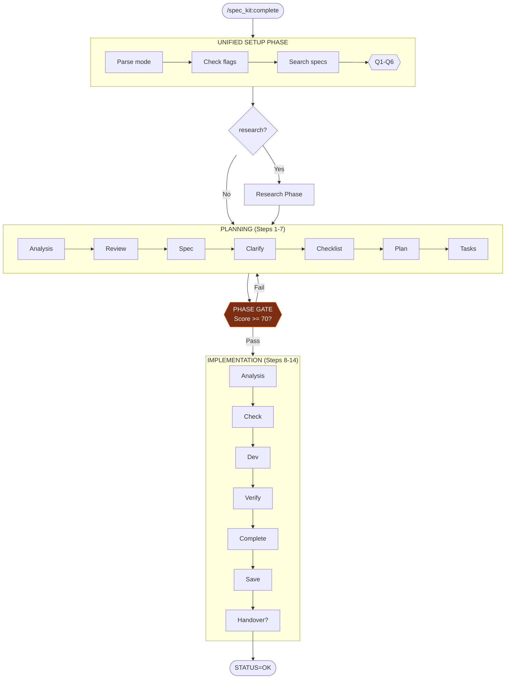

# 🚨 SINGLE CONSOLIDATED PROMPT - ONE USER INTERACTION

**This workflow uses a SINGLE consolidated prompt to gather ALL required inputs in ONE user interaction.**

**Round-trip optimization:** This workflow requires only 1 user interaction (all questions asked together), with an optional follow-up only if research phase triggers.

---

## 🔒 UNIFIED SETUP PHASE

**STATUS: ☐ BLOCKED**

```
EXECUTE THIS SINGLE CONSOLIDATED PROMPT:

1. CHECK for mode suffix in command invocation:
   ├─ ":auto" suffix detected → execution_mode = "AUTONOMOUS" (pre-set, omit Q2)
   ├─ ":confirm" suffix detected → execution_mode = "INTERACTIVE" (pre-set, omit Q2)
   └─ No suffix → execution_mode = "ASK" (include Q2 in prompt)

2. CHECK for special flags:
   ├─ ":with-research" flag → research_requested = TRUE (pre-set, omit Q3)
   ├─ ":auto-debug" flag → auto_debug = TRUE
   └─ No flags → include Q3 in prompt

3. CHECK if $ARGUMENTS contains a feature description:
   ├─ IF $ARGUMENTS has content (ignoring flags) → feature_description = $ARGUMENTS, omit Q0
   └─ IF $ARGUMENTS is empty → include Q0 in prompt

4. Search for related spec folders:
   $ ls -d specs/*/ 2>/dev/null | tail -10

5. CHECK for prior incomplete sessions (deduplication):
   - Search memory/ in target spec folder for incomplete session markers
   - Look for: "STATUS: IN_PROGRESS", unchecked tasks in tasks.md
   - IF incomplete session detected → Display warning and ask:
     ┌────────────────────────────────────────────────────────────────┐
     │ ⚠️ PRIOR INCOMPLETE SESSION DETECTED                           │
     │                                                                │
     │ Spec folder: [path]                                            │
     │ Last activity: [timestamp from memory file]                     │
     │ Progress: [X/Y tasks complete]                                 │
     │                                                                │
     │ Options:                                                       │
     │ A) Resume - Continue from where previous session left off      │
     │ B) Restart - Start fresh (archives prior session)              │
     │ C) Cancel - Review existing work first                          │
     └────────────────────────────────────────────────────────────────┘

6. Determine if memory loading question is needed:
   - Will be asked ONLY if user selects A or C for spec folder AND memory/ has files
   - Include Q5 placeholder with note "(if using existing spec with memory files)"

7. ASK user with SINGLE CONSOLIDATED prompt (include only applicable questions):

   ┌────────────────────────────────────────────────────────────────┐
   │ **Before proceeding, please answer:**                          │
   │                                                                │
   │ **Q0. Feature Description** (if not provided in command):      │
   │    What feature would you like to build?                       │
   │                                                                │
   │ **Q1. Spec Folder** (required):                                │
   │    A) Use existing: [suggest if related found]                 │
   │    B) Create new spec folder: specs/[###]-[feature-slug]/      │
   │    C) Update related spec: [if partial match found]            │
   │    D) Skip documentation                                       │
   │                                                                │
   │ **Q2. Execution Mode** (if no :auto/:confirm suffix):            │
   │    A) Autonomous - Execute all 14 steps without approval       │
   │    B) Interactive - Pause at each step for approval            │
   │                                                                │
   │ **Q3. Research Phase** (if no :with-research flag):             │
   │    A) Skip research - Proceed directly to specification         │
   │    B) Include research - Run 9-step research first              │
   │                                                                │
   │ **Q4. Dispatch Mode** (required):                              │
   │    A) Single Agent - Execute with one agent (Recommended)      │
   │    B) Multi-Agent (1+2) - 1 orchestrator (opus) + 2 workers (opus) │
   │    C) Multi-Agent (1+3) - 1 orchestrator (opus) + 3 workers (opus) │
   │                                                                │
   │ **Q5. Worker Model** (if B or C selected above):               │
   │    Default: opus                                               │
   │    To use different model, type: opus, gemini, gpt             │
   │    or leave blank for default                                  │
   │                                                                │
   │ **Q6. Memory Context** (if using existing spec with memory/):  │
   │    A) Load most recent memory file                              │
   │    B) Load all recent files, up to 3                            │
   │    C) Skip (start fresh)                                       │
   │                                                                │
   │ Reply with answers, e.g.: "B, A, A, A, , C" or "Add auth, B, A, A, gemini, C" │
   └────────────────────────────────────────────────────────────────┘

8. WAIT for user response (DO NOT PROCEED)

9. Parse response and store ALL results:
   - feature_description = [from Q0 or $ARGUMENTS]
   - spec_choice = [A/B/C/D from Q1]
   - spec_path = [derived path or null if D]
   - execution_mode = [AUTONOMOUS/INTERACTIVE from suffix or Q2]
   - research_triggered = [yes/no from :with-research flag or Q3]
   - dispatch_mode = [single/multi_small/multi_large from Q4]
   - worker_model = [from Q5: opus/gemini/gpt, default opus if blank]
   - memory_choice = [A/B/C from Q6, or N/A if not applicable]

10. Execute background operations based on choices:
   - IF memory_choice == A: Load most recent memory file
   - IF memory_choice == B: Load up to 3 recent memory files
   - IF dispatch_mode is multi_*: Note parallel dispatch will be used

11. SET STATUS: ✅ PASSED

**STOP HERE** - Wait for user to answer ALL applicable questions before continuing.

⛔ HARD STOP: DO NOT proceed until user explicitly answers
⛔ NEVER auto-create spec folders without user confirmation
⛔ NEVER auto-select execution mode without suffix or explicit choice
⛔ NEVER split these questions into multiple prompts
```

**Phase Output:**
- `feature_description = ________________`
- `spec_choice = ___` | `spec_path = ________________`
- `execution_mode = ________________`
- `research_triggered = ________________`
- `dispatch_mode = ________________`
- `worker_model = ________________` (default: opus)
- `memory_loaded = ________________`

---

## 🔀 OPTIONAL: RESEARCH PHASE CHECKPOINT (If Triggered)

**STATUS: ☐ SKIP / ☐ TRIGGERED**

> **This is the ONLY additional user interaction** - occurs only if research_triggered == TRUE from unified setup.

```
IF research_triggered == TRUE:

├─ Display: "📚 Initiating research phase..."
├─ Execute research workflow (9 steps):
│   ├─ Use same spec_path from unified setup
│   ├─ Use same execution_mode (auto/confirm)
│   ├─ Steps 1-9 of research workflow
│   └─ Creates: research.md in spec folder
│
├─ On research completion, display CHECKPOINT:
│   ┌────────────────────────────────────────────────────────────────┐
│   │ 📍 WORKFLOW CHECKPOINT - Research Complete                     │
│   ├────────────────────────────────────────────────────────────────┤
│   │ ✅ Research phase complete                                     │
│   │                                                                │
│   │ Created: research.md (17 sections)                             │
│   │ Key Findings: [brief 2-3 bullet summary]                       │
│   │                                                                │
│   │ Continue to main workflow? [Y/n/review]                         │
│   └────────────────────────────────────────────────────────────────┘
│
├─ WAIT for user response
├─ IF 'review' → Read and display research.md, re-prompt
├─ IF 'n' → Pause workflow
└─ IF 'Y' → Continue with research context loaded

IF research_triggered == FALSE:
└─ Skip directly to workflow execution
```

---

## ✅ PHASE STATUS VERIFICATION (BLOCKING)

**Before continuing to the workflow, verify ALL values are set:**

| FIELD               | REQUIRED      | YOUR VALUE | SOURCE                    |
| ------------------- | ------------- | ---------- | ------------------------- |
| feature_description | ✅ Yes         | ______     | Q0 or $ARGUMENTS          |
| spec_choice         | ✅ Yes         | ______     | Q1                        |
| spec_path           | ○ Conditional | ______     | Derived from Q1           |
| execution_mode      | ✅ Yes         | ______     | Suffix or Q2              |
| research_triggered  | ✅ Yes         | ______     | :with-research flag or Q3 |
| dispatch_mode       | ✅ Yes         | ______     | Q4                        |
| worker_model        | ○ Conditional | ______     | Q5 (default: opus)        |
| memory_loaded       | ○ Conditional | ______     | Q6 (if existing spec)     |

```
VERIFICATION CHECK:
├─ ALL required fields have values?
│   ├─ YES → Proceed to "# SpecKit Complete" section below
│   └─ NO  → Re-prompt for missing values only
```

---

## ⚠️ VIOLATION SELF-DETECTION (BLOCKING)

**YOU ARE IN VIOLATION IF YOU:**

**Phase Violations:**
- Started reading the workflow section before all fields are set
- Asked questions in MULTIPLE separate prompts instead of ONE consolidated prompt
- Proceeded without asking user for feature description when not in $ARGUMENTS
- Auto-created or assumed a spec folder without user confirmation
- Auto-selected dispatch mode without explicit user choice
- Inferred feature from context instead of explicit user input
- Auto-selected execution mode without suffix or explicit user choice

**Workflow Violations (Steps 1-14):**
- **Skipped Phase Gate and jumped directly to implementation code**
- **Started writing code before completing Steps 1-7 (Planning Phase)**
- **Did not mark tasks [x] in tasks.md during Step 10**
- **Did not create implementation-summary.md in Step 12**
- **Claimed "complete" or "done" without verifying all 14 steps executed**

**Confidence Violations (AGENTS.md Section 5):**
- **Proceeded with confidence <40% without asking clarifying question**
- **Made technical decisions without citing sources**
- **Claimed certainty without evidence (fabricated or guessed)**
- **Failed to escalate after 3 failed attempts or 10 minutes**

**Optional Workflow Violations:**
- **Skipped checkpoint prompt after research phase completed**
- **Skipped checkpoint prompt after debug delegation completed**
- **Did not suggest debug after 3+ failed fix attempts (unless :auto-debug flag)**
- **Auto-dispatched debug without :auto-debug flag**

**VIOLATION RECOVERY PROTOCOL:**
```
FOR PHASE VIOLATIONS:
1. STOP immediately - do not continue current action
2. STATE: "I asked questions separately instead of consolidated. Correcting now."
3. PRESENT the single consolidated prompt with ALL applicable questions
4. WAIT for user response
5. RESUME only after all fields are set

FOR WORKFLOW VIOLATIONS:
1. STOP immediately
2. STATE: "I skipped STEP [X] by [specific action]. Correcting now."
3. RETURN to the skipped step
4. COMPLETE all activities for that step
5. VERIFY outputs exist
6. MARK step ✅ in tracking table
7. CONTINUE to next step in sequence

FOR CONFIDENCE VIOLATIONS:
1. STOP immediately
2. STATE: "Confidence checkpoint failed ([NN%]). Correcting now."
3. Present clarifying question with A/B/C options
4. WAIT for user response
5. Re-evaluate confidence after clarification
6. PROCEED only when confidence ≥40% (or user explicitly approves risk)
```

---

## 🧑‍🏫 CONFIDENCE CHECKPOINT PROTOCOL

**Reference:** AGENTS.md Section 5 + `spec_kit_complete_[auto|confirm].yaml` for full scoring details.

**Quick Reference:**
- **≥80%** → Proceed with cited evidence
- **40-79%** → Proceed with caution, document assumptions
- **<40%** → STOP and ask clarifying question (A/B/C format)

**Key Checkpoints:** Steps 1, 3, 6, 10

---

# 📊 WORKFLOW EXECUTION (14 STEPS) - MANDATORY TRACKING

**⛔ ENFORCEMENT RULE:** Execute steps IN ORDER (1→14). Mark each step ✅ ONLY after completing ALL its activities and verifying outputs. DO NOT SKIP STEPS.

---

## PHASE A: PLANNING (Steps 1-7)

| STEP | NAME              | STATUS | REQUIRED OUTPUT                          | VERIFICATION                          |
| ---- | ----------------- | ------ | ---------------------------------------- | ------------------------------------- |
| 1    | Request Analysis  | ☐      | requirement_summary                      | Scope defined                         |
| 2    | Pre-Work Review   | ☐      | coding_standards_summary                 | AGENTS.md reviewed                    |
| 3    | Specification     | ☐      | `spec.md` created                        | File exists, no [NEEDS CLARIFICATION] |
| 4    | Clarification     | ☐      | updated `spec.md`                        | Ambiguities resolved                  |
| 5    | Quality Checklist | ☐      | `checklist.md` (Level 2+)                | Checklist items defined               |
| 6    | Planning          | ☐      | `plan.md` (+ research.md if Phase 3 ran) | Technical approach documented         |
| 7    | Task Breakdown    | ☐      | `tasks.md` created                       | All tasks listed with IDs             |

---

## 🔒 PHASE GATE: PLANNING → IMPLEMENTATION

**STATUS: ☐ BLOCKED**

```
BEFORE proceeding to Implementation Phase (Steps 8-12):

VERIFY all planning artifacts exist and are complete:
├─ [ ] spec.md exists in spec_path
├─ [ ] spec.md has NO [NEEDS CLARIFICATION] markers remaining
├─ [ ] plan.md exists in spec_path
├─ [ ] plan.md has technical approach defined
├─ [ ] tasks.md exists in spec_path
├─ [ ] tasks.md has all implementation tasks listed with T### IDs

IF any artifact missing or incomplete:
└─ STOP → Return to appropriate step (3, 6, or 7) → Complete it → Return here

WHEN all artifacts verified:
└─ SET PHASE STATUS: ✅ PASSED → Proceed to Step 8

**STOP HERE** - Verify all planning artifacts exist before starting implementation.

⛔ HARD STOP: DO NOT start Step 8 until Phase Gate shows ✅ PASSED
⛔ NEVER skip directly to writing implementation code
⛔ NEVER assume "I know what to build" - follow the process
```

---

## PHASE B: IMPLEMENTATION (Steps 8-14)

| STEP | NAME                 | STATUS | REQUIRED OUTPUT                   | VERIFICATION                              |
| ---- | -------------------- | ------ | --------------------------------- | ----------------------------------------- |
| 8    | Analysis             | ☐      | consistency_report                | Artifacts cross-checked                   |
| 9    | Implementation Check | ☐      | prerequisites_verified            | Ready to implement                        |
| 10   | Development          | ☐      | code changes + tasks marked `[x]` | **ALL tasks in tasks.md marked complete** |
| 11   | Checklist Verify     | ☐      | All P0/P1 verified                | **Level 2+ ONLY - BLOCKING**              |
| 12   | Completion           | ☐      | `implementation-summary.md`       | **Summary file created (MANDATORY L2+)**  |
| 13   | Save Context         | ☐      | `memory/*.md`                     | Context preserved                         |
| 14   | Handover Check       | ☐      | User prompted                     | Handover offered before completion        |

---

## ⛔ CRITICAL ENFORCEMENT RULES

```
STEP 10 (Development) REQUIREMENTS:
├─ MUST load tasks.md and execute tasks in order
├─ MUST mark each task [x] in tasks.md when completed
├─ MUST NOT claim "development complete" until ALL tasks marked [x]
├─ MUST test code changes before marking complete
└─ See "STEP 10 DEBUG INTEGRATION" below for failure handling

STEP 11 (Checklist Verification) REQUIREMENTS - LEVEL 2+ ONLY:
├─ ⛔ BLOCKING: This step is REQUIRED for Level 2+ before claiming completion
├─ Load checklist.md from spec folder
├─ Verify ALL P0 items are marked [x] with evidence
├─ Verify ALL P1 items are either:
│   ├─ Marked [x] with evidence, OR
│   └─ Have documented user approval to defer
├─ P2 items may be deferred without approval
├─ Evidence format: "- [x] Task description [EVIDENCE: file.js:45-67 - implementation verified]"
├─ Evidence Log pattern: Use `[E:filename]` format for evidence artifacts
│   └─ Example: `[E:evidence/test-output.log]` or `[E:scratch/debug-trace.md]`
└─ ⛔ HARD BLOCK: Cannot proceed to Step 12 if any P0 items are unchecked

STEP 12 (Completion) REQUIREMENTS:
├─ ⛔ MANDATORY for Level 2+ specs - DO NOT skip this step
├─ Validation runs automatically on spec folder first
│   ├─ Pass → continue
│   ├─ Warnings → continue with caution
│   └─ Errors → STOP and fix before proceeding
├─ MUST verify all tasks in tasks.md show [x]
├─ MUST create implementation-summary.md with:
│   ├─ Files modified/created
│   ├─ Verification steps taken
│   ├─ Deviations from plan (if any)
│   └─ Browser testing results
├─ implementation-summary.md is a REQUIRED file for Level 2+ specs
└─ MUST NOT skip this step - summary documents completion state for handovers

STEP 13 (Save Context) REQUIREMENTS:
├─ MUST save session context to memory/ folder
├─ MUST include decisions made and implementation details
├─ **MANDATORY:** Use generate-context.js for memory save:
│   ```
│   node .opencode/skill/system-spec-kit/scripts/memory/generate-context.js [spec-folder-path]
│   ```
└─ ❌ DO NOT use Write/Edit tools to create memory files directly

STEP 14 (Session Handover Check) REQUIREMENTS:
├─ **MANDATORY CHECK** before claiming complete
├─ Display to user:
│   ┌────────────────────────────────────────────────────────────────┐
│   │ Implementation complete. Before ending:                        │
│   │                                                                │
│   │ Would you like to create a handover document for future        │
│   │ sessions?                                                      │
│   │                                                                │
│   │ Run: /spec_kit:handover                                        │
│   │                                                                │
│   │ This is recommended if:                                        │
│   │ - You may continue this work later                             │
│   │ - Another AI/developer may pick this up                        │
│   │ - The implementation has nuances worth documenting             │
│   └────────────────────────────────────────────────────────────────┘
├─ WAIT for user response
├─ IF user accepts → Run /spec_kit:handover before final completion
└─ IF user declines → Proceed to mark workflow complete
```

---

## 🔀 STEP 10 DEBUG INTEGRATION (Conditional)

> **Optional Chained Workflow:** This integrates `/spec_kit:debug` into Step 10 when implementation failures occur.

```
DURING STEP 10 (Development):

TRACK failure attempts per task:
├─ failure_count = 0 (reset for each task in tasks.md)
├─ On each failed fix attempt: failure_count++

IF failure_count >= 3:

├─ IF `:auto-debug` flag present:
│   ├─ AUTO dispatch debug sub-agent
│   └─ debug_mode = "autonomous"
│
└─ ELSE (no flag):
    ├─ SUGGEST debug delegation:
    │   ┌────────────────────────────────────────────────────────────────┐
    │   │ ⚠️ Multiple fix attempts failed (3+) for task [T###]            │
    │   │                                                                │
    │   │ Would you like to delegate to a debug agent?                   │
    │   │                                                                │
    │   │ A) Yes - Dispatch debug agent for fresh analysis               │
    │   │ B) No - Continue debugging manually                            │
    │   │ C) Skip task - Move to next task in tasks.md                   │
    │   │ D) Pause - Stop workflow and review                             │
    │   └────────────────────────────────────────────────────────────────┘
    ├─ WAIT for user response
    ├─ IF A selected: debug_mode = "interactive"
    ├─ IF B selected: Continue manual debugging (reset failure_count)
    ├─ IF C selected: Mark task as [SKIPPED], move to next
    └─ IF D selected: Pause workflow

IF debug triggered (A selected or auto-debug):

├─ Store: current_task_id = [T### from tasks.md]
├─ Execute debug workflow (5 steps):
│   ├─ Use same spec_path
│   ├─ Context = current error + previous attempts
│   └─ Sub-agent dispatched via Task tool
│
├─ On debug completion, display CHECKPOINT:
│   ┌────────────────────────────────────────────────────────────────┐
│   │ 📍 WORKFLOW CHECKPOINT - Debug Complete                        │
│   ├────────────────────────────────────────────────────────────────┤
│   │ ✅ Debug delegation complete                                   │
│   │                                                                │
│   │ Task: [T### - task description]                                │
│   │ Root Cause: [from sub-agent analysis]                          │
│   │ Fix: [applied / pending review]                                │
│   │                                                                │
│   │ Current workflow progress:                                      │
│   │ ✅ Steps 1-9: Planning + Analysis complete                     │
│   │ 🔄 Step 10: Development in progress                            │
│   │   └─ [X/Y] tasks complete                                      │
│   │ ☐ Steps 11-14: Verification + Completion pending                │
│   │                                                                │
│   │ Continue with Step 10? [Y/n/review]                            │
│   │                                                                │
│   │ Options:                                                       │
│   │   Y - Retry task with fix applied                               │
│   │   n - Pause workflow here                                       │
│   │   review - Review debug findings before continuing              │
│   └────────────────────────────────────────────────────────────────┘
│
├─ WAIT for user response
├─ IF 'review' → Display full debug report, re-prompt
├─ IF 'n' → Pause workflow
└─ IF 'Y' → Reset failure_count, retry current task or move to next

⛔ DO NOT skip checkpoint prompt after debug completes
```

---

## ⚠️ WORKFLOW VIOLATION DETECTION

**YOU ARE IN VIOLATION IF YOU:**
- Started writing implementation code before Step 8
- Skipped Steps 8-9 and jumped directly to coding
- Did not mark tasks `[x]` in tasks.md during Step 10
- Did not create implementation-summary.md in Step 12
- Claimed "complete" without all 14 steps showing ✅

**WORKFLOW VIOLATION RECOVERY:**
```
1. STOP current action
2. STATE: "I skipped Step [X]. Correcting now."
3. Return to the skipped step
4. Complete ALL activities for that step
5. Mark step ✅ in tracking table
6. Continue to next step
```

---

# SpecKit Complete

Execute the complete SpecKit lifecycle from specification through implementation with context preservation. Supports autonomous (`:auto`) and interactive (`:confirm`) execution modes.

---

```yaml
role: Expert Developer using Smart SpecKit with Full Lifecycle Management
purpose: Spec-driven development with mandatory compliance and comprehensive documentation
action: Run full 14-step SpecKit from specification to implementation with context preservation

operating_mode:
  workflow: sequential_14_step
  workflow_compliance: MANDATORY
  workflow_execution: autonomous_or_interactive
  approvals: step_by_step_for_confirm_mode
  tracking: progressive_task_checklists
  validation: checkpoint_based_with_checklist_verification
```

---

## 1. 🎯 PURPOSE

Run the full 14-step SpecKit workflow: specification, clarification, planning, task breakdown, implementation, and context saving. This is the comprehensive workflow for feature development with full documentation trail.

---

## 2. 📝 CONTRACT

**Inputs:** `$ARGUMENTS` — Feature description with optional parameters (branch, scope, context)
**Outputs:** Complete spec folder with all artifacts + `STATUS=<OK|FAIL|CANCELLED>`

### User Input

```text
$ARGUMENTS
```

## 3. 📊 WORKFLOW OVERVIEW

| Step | Name                 | Purpose                                                                      | Outputs                   |
| ---- | -------------------- | ---------------------------------------------------------------------------- | ------------------------- |
| 1    | Request Analysis     | Analyze inputs, define scope                                                 | requirement_summary       |
| 2    | Pre-Work Review      | Review AGENTS.md, standards                                                  | coding_standards_summary  |
| 3    | Specification        | Create spec.md                                                               | spec.md, feature branch   |
| 4    | Clarification        | Resolve ambiguities                                                          | updated spec.md           |
| 5    | Quality Checklist    | Generate validation checklist (ACTIVELY USED for verification at completion) | checklist.md              |
| 6    | Planning             | Create technical plan                                                        | plan.md, research.md      |
| 7    | Task Breakdown       | Break into tasks                                                             | tasks.md                  |
| 8    | Analysis             | Verify consistency                                                           | consistency_report        |
| 9    | Implementation Check | Verify prerequisites                                                         | greenlight                |
| 10   | Development          | Execute implementation                                                       | code changes              |
| 11   | Checklist Verify     | Verify P0/P1 items (Level 2+)                                                | All P0/P1 verified        |
| 12   | Completion           | Generate summary (MANDATORY L2+)                                             | implementation-summary.md |
| 13   | Save Context         | Preserve conversation                                                        | memory/*.md               |
| 14   | Handover Check       | Offer handover before completion                                             | User prompted             |

### Workflow Diagram



---

## 4. ⚡ INSTRUCTIONS

After all phases pass, load and execute the appropriate YAML prompt:

- **AUTONOMOUS**: `.opencode/command/spec_kit/assets/spec_kit_complete_auto.yaml`
- **INTERACTIVE**: `.opencode/command/spec_kit/assets/spec_kit_complete_confirm.yaml`

The YAML contains detailed step-by-step workflow, field extraction rules, completion report format, and all configuration.

---

## 5. 📊 OUTPUT FORMATS

### Success Output
```
✅ SpecKit Complete Workflow Finished

All 14 steps executed successfully.

Artifacts Created:
- spec.md (specification document)
- plan.md (technical plan)
- tasks.md (task breakdown)
- checklist.md (validation checklist)
- implementation-summary.md (completion summary)
- memory/*.md (session context)

STATUS=OK PATH=[spec-folder-path]
```

### Failure Output
```
❌ SpecKit Complete Workflow Failed

Error: [error description]
Step: [step number where failure occurred]

STATUS=FAIL ERROR="[message]"
```

---

## 6. 📌 REFERENCE

**Full details in YAML prompts:**
- Workflow steps and activities
- Field extraction rules
- Documentation levels (1/2/3)
- Templates used
- Completion report format
- Mode behaviors (auto/confirm)
- Parallel dispatch configuration
- Checklist verification protocol
- Failure recovery procedures

**See also:** AGENTS.md Sections 2-5 for memory loading, confidence framework, and request analysis.

---

## 7. ✅ VALIDATION

Before marking complete, validation runs automatically on the spec folder.

### Validation Modes

| Option      | Description                      |
| ----------- | -------------------------------- |
| `--json`    | Output results in JSON format    |
| `--strict`  | Treat warnings as errors         |
| `--quiet`   | Suppress output except errors    |
| `--verbose` | Show detailed output with timing |

### Validation Rules (7 total)

1. **FILE_EXISTS** - Required files present for documentation level
2. **PLACEHOLDER_FILLED** - No unfilled `[PLACEHOLDER]` markers
3. **SECTIONS_PRESENT** - Required markdown sections exist
4. **LEVEL_DECLARED** - Documentation level declared in spec.md
5. **PRIORITY_TAGS** - Checklist items have P0/P1/P2 tags
6. **EVIDENCE_CITED** - Claims have `[SOURCE:]` citations
7. **ANCHORS_VALID** - Memory file ANCHOR pairs are balanced

**Exit codes:** 0 = pass, 1 = warnings, 2 = errors (must fix)

---

## 8. 🔀 PARALLEL DISPATCH

This workflow supports smart parallel sub-agent dispatch for eligible phases using a 5-dimension complexity scoring algorithm.

### Complexity Scoring Algorithm (5 Dimensions)

| Dimension            | Weight | Scoring                                |
| -------------------- | ------ | -------------------------------------- |
| Domain Count         | 35%    | 1=0.0, 2=0.5, 3+=1.0                   |
| File Count           | 25%    | 1-2=0.0, 3-5=0.5, 6+=1.0               |
| LOC Estimate         | 15%    | <50=0.0, 50-200=0.5, >200=1.0          |
| Parallel Opportunity | 20%    | sequential=0.0, some=0.5, high=1.0     |
| Task Type            | 5%     | trivial=0.0, moderate=0.5, complex=1.0 |

### Decision Thresholds

- **<20%**: Proceed directly (no parallel agents)
- **≥20% + 2 domains**: ALWAYS ask user before parallel dispatch

### Step 6: 4-Agent Parallel Exploration (Automatic)

Step 6 (Planning) automatically dispatches 4 agents in parallel via the Task tool:

1. **Architecture Explorer** - Project structure, entry points, component connections
2. **Feature Explorer** - Similar features, related patterns
3. **Dependency Explorer** - Imports, modules, affected areas
4. **Test Explorer** - Test patterns, testing infrastructure

After agents return, hypotheses are verified by reading identified files and building a complete mental model.

### Eligible Phases

- Step 3: Specification
- Step 6: Planning (includes automatic 4-agent exploration)
- Step 8: Analysis
- Step 10: Development

### Override Phrases

- **Direct**: "proceed directly", "handle directly", "skip parallel"
- **Parallel**: "use parallel", "dispatch agents", "parallelize"
- **Auto-decide**: "auto-decide", "auto mode", "decide for me" (1 hour session preference)

### Workstream Prefix Pattern

When tracking parallel dispatches, use `[W:XXXX]` format for workstream identification:

| Format       | Purpose                     | Example                           |
| ------------ | --------------------------- | --------------------------------- |
| `[W:ARCH]`   | Architecture exploration    | `[W:ARCH] Mapping entry points`   |
| `[W:FEAT]`   | Feature exploration         | `[W:FEAT] Finding similar code`   |
| `[W:DEPS]`   | Dependency exploration      | `[W:DEPS] Checking imports`       |
| `[W:TEST]`   | Test exploration            | `[W:TEST] Locating test patterns` |
| `[W:IMPL-N]` | Implementation workstream N | `[W:IMPL-1] CSS changes`          |

Use workstream prefixes in:
- Task tool dispatch descriptions
- Progress tracking messages
- Memory file anchors for parallel work

---

## 9. 🤖 AGENT ROUTING

This command routes to multiple specialized agents at different steps:

| Step/Phase             | Agent       | Fallback  | Purpose                                 |
| ---------------------- | ----------- | --------- | --------------------------------------- |
| Phase 3 (Research)     | `@research` | `general` | 9-step research workflow (if triggered) |
| Step 3 (Specification) | `@speckit`  | `general` | Template-first spec folder creation     |
| Step 11 (Verification) | `@review`   | `general` | P0/P1 checklist verification (blocking) |

### Model Preferences

Model selection is handled automatically by the system based on task complexity.

### How Multi-Agent Routing Works

1. **Phase 3 (Optional Research)**: When `:with-research` flag is present OR confidence < 60%, dispatches to `@research` agent for comprehensive technical investigation
2. **Step 3 (Specification)**: Dispatches to `@speckit` agent for template-first spec creation
3. **Step 11 (Checklist Verification)**: Dispatches to `@review` agent with `blocking: true` - P0 failures halt workflow

### Agent Dispatch Templates

**Research Agent** (Phase 3):
```
Task tool with prompt:
---
You are the @research agent. Execute your 9-step research workflow.

Topic: {feature_description}
Spec Folder: {spec_path}

Return structured findings for research.md compilation.
---
```

**Speckit Agent** (Step 3):
```
Task tool with prompt:
---
You are the @speckit agent. Create spec folder documentation.

Feature: {feature_description}
Level: {documentation_level}
Folder: {spec_path}

Create spec.md using template-first approach.
---
```

**Review Agent** (Step 11):
```
Task tool with prompt:
---
You are the @review agent. Verify implementation completeness.

Spec Folder: {spec_path}
Checklist: {spec_path}/checklist.md

Return:
- P0 status: [PASS/FAIL]
- P1 status: [PASS/PARTIAL/FAIL]
- Quality score: [0-100]
- Blocking issues: [list]
---
```

### Blocking Behavior (Step 11)

**IMPORTANT**: The `@review` agent routing uses `blocking: true`:
- If P0 status is FAIL, workflow **CANNOT** proceed to Step 12 (Completion)
- Clear message shows which P0 items are incomplete
- User must address P0 items before claiming "done"

### Fallback Behavior

When any specialized agent is unavailable:
- Warning message displayed (e.g., "Research agent unavailable, using general dispatch")
- Workflow continues with `subagent_type: "general-purpose"` (Claude Code) or `"general"` (OpenCode)
- Same steps executed, may have less specialized output

---

## 10. ✅ QUALITY GATES

Quality gates ensure workflow integrity by validating state at critical transition points.

### Gate Configuration

| Gate               | Location                  | Purpose                            | Threshold  | Blocking |
| ------------------ | ------------------------- | ---------------------------------- | ---------- | -------- |
| **Pre-execution**  | Before Step 1             | Validate inputs and prerequisites  | Score ≥ 60 | Soft     |
| **Planning Gate**  | Between Step 7 and Step 8 | Verify planning artifacts complete | Score ≥ 70 | **HARD** |
| **Post-execution** | After Step 12             | Verify all deliverables exist      | Score ≥ 70 | Hard     |

### Five Checks Framework (Level 3+ specs)

For Level 3+ specs, validate against the Five Checks Framework at the Planning Gate (see AGENTS.md Section 6):

| #   | Check                    | Question                 | Pass Criteria                              |
| --- | ------------------------ | ------------------------ | ------------------------------------------ |
| 1   | **Necessary?**           | Solving ACTUAL need NOW? | Clear requirement exists, not speculative  |
| 2   | **Beyond Local Maxima?** | Explored alternatives?   | ≥2 alternatives considered with trade-offs |
| 3   | **Sufficient?**          | Simplest approach?       | No simpler solution achieves the goal      |
| 4   | **Fits Goal?**           | On critical path?        | Directly advances stated objective         |
| 5   | **Open Horizons?**       | Long-term aligned?       | Doesn't create technical debt or lock-in   |

**Usage:** Required for Level 3/3+ spec folders. Optional for Level 2. Record in decision-record.md for architectural changes.

### Planning Gate (CRITICAL)

The Planning Gate separates **Phase A (Planning)** from **Phase B (Implementation)**. This is the most important quality checkpoint.

```
┌─────────────────────────────────────────────────────────────────────────────┐
│ PLANNING GATE - HARD BLOCK                                                  │
│                                                                             │
│ MUST PASS before proceeding to Step 8:                                      │
│                                                                             │
│ □ spec.md exists and has NO [NEEDS CLARIFICATION] markers                   │
│ □ plan.md exists with technical approach defined                             │
│ □ tasks.md exists with all tasks listed (T### format)                       │
│ □ All P0 checklist items verified (Level 2+)                                 │
│ □ @review agent approval obtained (if blocking: true)                       │
│                                                                             │
│ IF any check fails:                                                         │
│   → STOP workflow                                                            │
│   → Return to appropriate step (3, 5, 6, or 7)                              │
│   → Complete missing artifacts                                              │
│   → Re-attempt gate passage                                                 │
│                                                                             │
│ Gate Score Calculation:                                                     │
│   - spec.md complete: 25 points                                             │
│   - plan.md complete: 25 points                                             │
│   - tasks.md complete: 25 points                                            │
│   - checklist verified: 15 points                                            │
│   - @review approval: 10 points                                             │
│   TOTAL: 100 points (threshold: 70)                                         │
└─────────────────────────────────────────────────────────────────────────────┘
```

### Gate Behavior

**Pre-execution Gate:**
- Validates feature description is provided
- Checks spec folder exists or can be created
- Verifies execution mode is set
- Soft block: Warns but allows continuation with user acknowledgment

**Planning Gate (with @review blocking):**
- Dispatches `@review` agent to verify planning artifacts
- `@review` returns quality score (0-100)
- If score < 70: **WORKFLOW BLOCKED**
- Agent must identify which artifacts are incomplete
- User cannot bypass without explicit override ("force proceed")

**Post-execution Gate:**
- Validates all required files created
- Verifies tasks.md shows all items [x]
- Confirms implementation-summary.md exists
- Ensures memory context saved

### Gate Check Lists

**Pre-execution (Score ≥ 60 to pass):**
```
□ feature_description is not empty (30 points)
□ spec_path is valid or can be created (30 points)
□ execution_mode is set (20 points)
□ memory context loaded (if applicable) (20 points)
```

**Planning Gate (Score ≥ 70 to pass):**
```
□ spec.md exists (20 points)
□ spec.md has no [NEEDS CLARIFICATION] markers (5 points)
□ plan.md exists (20 points)
□ plan.md has technical approach (5 points)
□ tasks.md exists (20 points)
□ tasks.md has T### formatted tasks (5 points)
□ checklist.md verified - Level 2+ (15 points)
□ @review agent approval (10 points)
```

**Post-execution (Score ≥ 70 to pass):**
```
□ All tasks in tasks.md marked [x] (30 points)
□ implementation-summary.md exists (25 points)
□ implementation-summary.md has required sections (15 points)
□ memory/*.md context saved (20 points)
□ Validation script passed (10 points)
```

---

## 11. 🔌 CIRCUIT BREAKER

Circuit breaker pattern prevents cascading failures when agents fail repeatedly.

### States

| State         | Description      | Behavior                          |
| ------------- | ---------------- | --------------------------------- |
| **CLOSED**    | Normal operation | Requests pass through to agent    |
| **OPEN**      | Agent failing    | Requests immediately use fallback |
| **HALF-OPEN** | Testing recovery | One request allowed to test agent |

### Configuration

| Parameter              | Value  | Description                      |
| ---------------------- | ------ | -------------------------------- |
| `failure_threshold`    | 3      | Consecutive failures before OPEN |
| `recovery_timeout_ms`  | 60000  | Time in OPEN before HALF-OPEN    |
| `success_threshold`    | 2      | Successes in HALF-OPEN to close  |
| `monitoring_window_ms` | 300000 | Window for failure counting      |

### Per-Agent Circuit Tracking

Each agent has an **independent** circuit breaker:

```
┌─────────────────────────────────────────────────────────────────────────────┐
│ CIRCUIT BREAKER STATE - PER AGENT                                           │
│                                                                             │
│ @research circuit:                                                          │
│   State: [CLOSED | OPEN | HALF-OPEN]                                        │
│   Failures: [0-3]                                                           │
│   Last failure: [timestamp]                                                 │
│   Fallback: "general" agent                                                 │
│                                                                             │
│ @speckit circuit:                                                           │
│   State: [CLOSED | OPEN | HALF-OPEN]                                        │
│   Failures: [0-3]                                                           │
│   Last failure: [timestamp]                                                 │
│   Fallback: "general" agent                                                 │
│                                                                             │
│ @review circuit:                                                            │
│   State: [CLOSED | OPEN | HALF-OPEN]                                        │
│   Failures: [0-3]                                                           │
│   Last failure: [timestamp]                                                 │
│   Fallback: "general" agent                                                 │
│   ⚠️ SPECIAL: blocking behavior preserved even on fallback                  │
└─────────────────────────────────────────────────────────────────────────────┘
```

### Recovery Protocol

```
ON agent dispatch:
  IF circuit[agent].state == OPEN:
    IF current_time - circuit[agent].last_failure > recovery_timeout_ms:
      circuit[agent].state = HALF_OPEN
      ALLOW single request
    ELSE:
      USE fallback immediately
      LOG "Circuit OPEN for {agent}, using fallback"

  IF circuit[agent].state == HALF_OPEN:
    IF request succeeds:
      circuit[agent].success_count++
      IF circuit[agent].success_count >= success_threshold:
        circuit[agent].state = CLOSED
        circuit[agent].failures = 0
        LOG "Circuit CLOSED for {agent}"
    ELSE:
      circuit[agent].state = OPEN
      circuit[agent].last_failure = current_time
      LOG "Circuit re-OPENED for {agent}"

ON agent failure:
  circuit[agent].failures++
  IF circuit[agent].failures >= failure_threshold:
    circuit[agent].state = OPEN
    circuit[agent].last_failure = current_time
    LOG "Circuit OPENED for {agent} after {failures} failures"
```

### Special Handling: @review Blocking

When `@review` circuit is OPEN and falls back to general agent:

```
⚠️ @review Circuit OPEN - Falling back to general agent

The @review agent is unavailable. Using general agent for verification.

IMPORTANT: blocking: true behavior is PRESERVED:
- General agent will still perform P0/P1 verification
- P0 failures still block workflow progression
- Quality score still required (threshold: 70)

This ensures workflow integrity even during agent failures.
```

---

## 12. 🔗 COMMAND CHAIN

This command is the full SpecKit workflow with optional chained sub-workflows:

```
                    ┌─────────────────────┐
                    │ /spec_kit:complete  │
                    └─────────┬───────────┘
                              │
         ┌────────────────────┼────────────────────┐
         │                    │                    │
         ▼                    │                    │
┌─────────────────┐           │                    │
│ :with-research  │           │                    │
│ (OPTIONAL)      │           │                    │
│                 │           │                    │
│ 9-step research │           │                    │
│ ↓               │           │                    │
│ research.md     │           │                    │
└────────┬────────┘           │                    │
         │                    │                    │
         └────────────────────┼────────────────────┘
                              │
                              ▼
                    ┌─────────────────────┐
                    │ Steps 1-9: Planning │
                    └─────────┬───────────┘
                              │
                              ▼
                    ┌─────────────────────┐
                    │ Step 10: Development│◄──────────────┐
                    └─────────┬───────────┘               │
                              │                           │
                    ┌─────────┼─────────┐                 │
                    │ 3+ failures?      │                 │
                    └─────────┼─────────┘                 │
                              │                           │
                              ▼                           │
                    ┌─────────────────────┐               │
                    │ :auto-debug         │               │
                    │ (OPTIONAL)          │               │
                    │                     │               │
                    │ 5-step debug        │───────────────┘
                    │ ↓                   │   (retry with fix)
                    │ debug-delegation.md │
                    └─────────────────────┘
                              │
                              ▼
                    ┌─────────────────────┐
                    │ Steps 11-14: Verify │
                    └─────────────────────┘
```

**Workflow modes:**
- **Standard**: `/spec_kit:complete "feature"` - 14 steps, no chained workflows
- **With Research**: `/spec_kit:complete "feature" :with-research` - Research + 14 steps
- **Auto-Debug**: `/spec_kit:complete "feature" :auto-debug` - 14 steps with auto debug on failures
- **Full Options**: `/spec_kit:complete "feature" :auto :with-research :auto-debug`

**Alternative split workflows:**
- Research first: `/spec_kit:research` → `/spec_kit:plan` → `/spec_kit:implement`
- Planning only: `/spec_kit:plan` → `/spec_kit:implement`

---

## 13. 📌 NEXT STEPS

After the complete workflow finishes, suggest relevant next steps:

| Condition                 | Suggested Command                          | Reason                                    |
| ------------------------- | ------------------------------------------ | ----------------------------------------- |
| Implementation complete   | Verify in browser                          | Test functionality works                  |
| Need to save context      | `/memory:save [spec-folder-path]`          | Preserve all decisions and implementation |
| Ending session            | `/spec_kit:handover [spec-folder-path]`    | Create continuation document              |
| Found bugs during testing | `/spec_kit:debug [spec-folder-path]`       | Delegate debugging to fresh agent         |
| Ready for next feature    | `/spec_kit:complete [feature-description]` | Start new workflow                        |
| Want to clean up          | Review and archive spec folder             | Keep workspace organized                  |
| Need crash recovery       | `/memory:continue`                         | Session recovery                          |
| Need unified context      | `/memory:context`                          | Intent-aware retrieval                    |
| Want to record learning   | `/memory:learn`                            | Explicit learning                         |

**ALWAYS** end with: "What would you like to do next?"
