# 🚨 SINGLE CONSOLIDATED PROMPT - ONE USER INTERACTION

**This workflow uses a SINGLE consolidated prompt to gather ALL required inputs in ONE user interaction.**

**Round-trip optimization:** This workflow requires only 1 user interaction (all questions asked together).

---

## 🔒 UNIFIED SETUP PHASE

**STATUS: ☐ BLOCKED**

```
EXECUTE THIS SINGLE CONSOLIDATED PROMPT:

1. CHECK for mode suffix in command invocation:
   ├─ ":auto" suffix detected → execution_mode = "AUTONOMOUS" (pre-set, omit Q2)
   ├─ ":confirm" suffix detected → execution_mode = "INTERACTIVE" (pre-set, omit Q2)
   └─ No suffix → execution_mode = "ASK" (include Q2 in prompt)

2. CHECK if $ARGUMENTS contains a research topic:
   ├─ IF $ARGUMENTS has content (ignoring :auto/:confirm) → research_topic = $ARGUMENTS, omit Q0
   └─ IF $ARGUMENTS is empty → include Q0 in prompt

3. Search for related spec folders:
   $ ls -d specs/*/ 2>/dev/null | tail -10

4. Search for prior work (background, no user wait):
   - memory_match_triggers(prompt=research_topic OR "research")
   - memory_search(query=research_topic OR "research", includeConstitutional=true)
   - Store: prior_work_found = [yes/no], prior_work_count = [N]

5. ASK user with SINGLE CONSOLIDATED prompt (include only applicable questions):

   ┌────────────────────────────────────────────────────────────────┐
   │ **Before proceeding, please answer:**                          │
   │                                                                │
   │ **Q0. Research Topic** (if not provided in command):           │
   │    What topic would you like to research?                      │
   │                                                                │
   │ **Q1. Spec Folder** (required):                                │
   │    A) Use existing: [suggest if related found]                 │
   │    B) Create new spec folder: specs/[###]-[topic-slug]/        │
   │    C) Update related spec: [if partial match found]            │
   │    D) Skip documentation (research only, no artifacts)         │
   │                                                                │
   │ **Q2. Execution Mode** (if no :auto/:confirm suffix):            │
   │    A) Autonomous - Execute all 9 steps without approval        │
   │    B) Interactive - Pause at each step for approval            │
   │                                                                │
   │ **Q3. Dispatch Mode** (required):                              │
   │    A) Single Agent - Execute with one agent (Recommended)      │
   │    B) Multi-Agent (1+2) - 1 orchestrator (opus) + 2 workers (opus) │
   │    C) Multi-Agent (1+3) - 1 orchestrator (opus) + 3 workers (opus) │
   │                                                                │
   │ **Q4. Worker Model** (if B or C selected above):               │
   │    Default: opus                                               │
   │    To use different model, type: opus, gemini, gpt             │
   │    for default                                                 │
   │                                                                │
   │ **Q5. Prior Work** (if [N] related memories found):            │
   │    A) Load all matches (comprehensive context)                 │
   │    B) Load constitutional only (foundational rules)            │
   │    C) Skip (start fresh)                                       │
   │                                                                │
   │ **Q6. Memory Context** (if using existing spec with memory/):  │
   │    A) Load most recent memory file                              │
   │    B) Load all recent files, up to 3                            │
   │    C) Skip (start fresh)                                       │
   │                                                                │
   │ Reply with answers, e.g.: "B, A, A, , C" or "AI chat, B, A, gemini, C, A" │
   └────────────────────────────────────────────────────────────────┘

6. WAIT for user response (DO NOT PROCEED)

7. Parse response and store ALL results:
   - research_topic = [from Q0 or $ARGUMENTS]
   - spec_choice = [A/B/C/D from Q1]
   - spec_path = [derived path or null if D]
   - execution_mode = [AUTONOMOUS/INTERACTIVE from suffix or Q2]
   - dispatch_mode = [single/multi_small/multi_large from Q3]
   - worker_model = [from Q4: opus/gemini/gpt, default opus if blank]
   - prior_work_choice = [A/B/C from Q5, or N/A if no matches]
   - memory_choice = [A/B/C from Q6, or N/A if not applicable]

8. Execute background operations based on choices:
   - IF prior_work_choice == A: Load all prior work matches
   - IF prior_work_choice == B: Load constitutional only
   - IF memory_choice == A: Load most recent memory file
   - IF memory_choice == B: Load up to 3 recent memory files
   - IF dispatch_mode is multi_*: Note parallel dispatch will be used

9. SET STATUS: ✅ PASSED

**STOP HERE** - Wait for user to answer ALL applicable questions before continuing.

⛔ HARD STOP: DO NOT proceed until user explicitly answers
⛔ NEVER auto-create spec folders without user confirmation
⛔ NEVER auto-select execution mode without suffix or explicit choice
⛔ NEVER split these questions into multiple prompts
```

**Phase Output:**
- `research_topic = ________________`
- `spec_choice = ___` | `spec_path = ________________`
- `execution_mode = ________________`
- `dispatch_mode = ________________`
- `worker_model = ________________` (default: opus)
- `prior_work_loaded = ________________`
- `memory_loaded = ________________`

---

## ✅ PHASE STATUS VERIFICATION (BLOCKING)

**Before continuing to the workflow, verify ALL values are set:**

| FIELD             | REQUIRED      | YOUR VALUE | SOURCE                |
| ----------------- | ------------- | ---------- | --------------------- |
| research_topic    | ✅ Yes         | ______     | Q0 or $ARGUMENTS      |
| spec_choice       | ✅ Yes         | ______     | Q1                    |
| spec_path         | ○ Conditional | ______     | Derived from Q1       |
| execution_mode    | ✅ Yes         | ______     | Suffix or Q2          |
| dispatch_mode     | ✅ Yes         | ______     | Q3                    |
| worker_model      | ○ Conditional | ______     | Q4 (default: opus)    |
| prior_work_loaded | ○ Conditional | ______     | Q5 (if matches found) |
| memory_loaded     | ○ Conditional | ______     | Q6 (if existing spec) |

```
VERIFICATION CHECK:
├─ ALL required fields have values?
│   ├─ YES → Proceed to "# SpecKit Research" section below
│   └─ NO  → Re-prompt for missing values only
```

---

## ⚠️ VIOLATION SELF-DETECTION (BLOCKING)

**YOU ARE IN VIOLATION IF YOU:**
- Started reading the workflow section before all fields are set
- Asked questions in MULTIPLE separate prompts instead of ONE consolidated prompt
- Proceeded without asking user for research topic when not in $ARGUMENTS
- Auto-created or assumed a spec folder without user confirmation
- Auto-selected dispatch mode without explicit user choice
- Inferred topic from context instead of explicit user input
- Auto-selected execution mode without suffix or explicit user choice

**VIOLATION RECOVERY PROTOCOL:**
```
1. STOP immediately - do not continue current action
2. STATE: "I asked questions separately instead of consolidated. Correcting now."
3. PRESENT the single consolidated prompt with ALL applicable questions
4. WAIT for user response
5. RESUME only after all fields are set
```

---

# SpecKit Research

Conduct comprehensive technical investigation and create research documentation. Use before specification when technical uncertainty exists or to document findings for future reference.

---

```yaml
role: Technical Researcher with Comprehensive Analysis Expertise
purpose: Conduct deep technical investigation and create structured research documentation
action: Run 9-step research workflow from investigation through documentation compilation

operating_mode:
  workflow: sequential_9_step
  workflow_compliance: MANDATORY
  workflow_execution: autonomous_or_interactive
  approvals: step_by_step_for_confirm_mode
  tracking: research_finding_accumulation
  validation: completeness_check_17_sections
```

---

## 1. 🎯 PURPOSE

Run the 9-step research workflow: codebase investigation, external research, technical analysis, and documentation. Creates research.md with comprehensive findings. Use when technical uncertainty exists before planning.

---

## 2. 📝 CONTRACT

**Inputs:** `$ARGUMENTS` — Research topic with optional parameters (focus, scope, constraints)
**Outputs:** Spec folder with research.md (17 sections) + `STATUS=<OK|FAIL|CANCELLED>`

### User Input

```text
$ARGUMENTS
```

---

## 3. 📊 WORKFLOW OVERVIEW

| Step | Name                   | Purpose                       | Outputs                              |
| ---- | ---------------------- | ----------------------------- | ------------------------------------ |
| 1    | Request Analysis       | Define research scope         | feature_summary, research_objectives |
| 2    | Pre-Work Review        | Review AGENTS.md, standards   | principles_established               |
| 3    | Codebase Investigation | Explore existing patterns     | current_state_analysis               |
| 4    | External Research      | Research docs, best practices | best_practices_summary               |
| 5    | Technical Analysis     | Feasibility assessment        | technical_specifications             |
| 6    | Quality Checklist      | Generate validation checklist | quality_checklist                    |
| 7    | Solution Design        | Architecture and patterns     | solution_architecture                |
| 8    | Research Compilation   | Create research.md            | research.md                          |
| 9    | Save Context           | Preserve conversation         | memory/*.md                          |

### Execution Mode Behaviors

| Mode       | Invocation                           | Behavior                                   |
| ---------- | ------------------------------------ | ------------------------------------------ |
| `:auto`    | `/spec_kit:research:auto "topic"`    | Execute all 9 steps without approval gates |
| `:confirm` | `/spec_kit:research:confirm "topic"` | Pause at each step for user approval       |
| (default)  | `/spec_kit:research "topic"`         | Ask user to choose mode during Phase 2     |

### Mode Examples

**:auto mode** - Full autonomy, no confirmation gates:
```
/spec_kit:research:auto "How does the authentication system work?"

Behavior:
- Phase 1: Parses "How does the authentication system work?" as topic
- Phase 2: Asks spec folder question ONLY (mode pre-set to AUTONOMOUS)
- Steps 1-9: Execute sequentially without pausing for approval
- Output: Complete research.md with all 17 sections
```

**:confirm mode** - Pause at each phase for approval:
```
/spec_kit:research:confirm "Evaluate migration options for Postgres to MySQL"

Behavior:
- Phase 1: Parses topic
- Phase 2: Asks spec folder question ONLY (mode pre-set to INTERACTIVE)
- Step 1: Shows scope analysis → "Approve scope? [Y/n]"
- Step 3: Shows codebase findings → "Proceed to external research? [Y/n]"
- Step 5: Shows technical analysis → "Approve recommendations? [Y/n]"
- ...continues with approval gates at each step
```

**Default mode** - User chooses during setup:
```
/spec_kit:research "Compare WebSocket vs SSE for real-time updates"

Behavior:
- Phase 1: Parses topic
- Phase 2: Asks BOTH questions:
  1. Spec Folder: A/B/C/D
  2. Execution Mode: A) Autonomous or B) Interactive
- User responds: "B, A" (new spec folder, autonomous execution)
- Proceeds with autonomous execution
```

### Mode Selection Guidance

| Scenario                                     | Recommended Mode |
| -------------------------------------------- | ---------------- |
| Quick research, known domain                 | `:auto`          |
| Complex topic, need validation at each step  | `:confirm`       |
| First time researching unfamiliar area       | `:confirm`       |
| Re-running research with minor scope changes | `:auto`          |
| Multi-stakeholder decision requiring review  | `:confirm`       |

### Workflow Diagram

```mermaid
flowchart TB
    subgraph SETUP["🔒 UNIFIED SETUP PHASE"]
        direction TB
        S1[/"Command Invocation<br>/spec_kit:research [topic]"/]
        S2{Mode Suffix?}
        S3[":auto → AUTONOMOUS"]
        S4[":confirm → INTERACTIVE"]
        S5["No suffix → ASK user"]
        S6["Consolidated Prompt<br>(Q0-Q6)"]
        S7[/"User Response"/]

        S1 --> S2
        S2 -->|":auto"| S3
        S2 -->|":confirm"| S4
        S2 -->|"none"| S5
        S3 --> S6
        S4 --> S6
        S5 --> S6
        S6 --> S7
    end

    subgraph MEMORY_PRE["🧠 MEMORY CHECK"]
        direction TB
        M1["memory_match_triggers()"]
        M2["memory_search()<br>anchors: research, findings"]
        M3{Prior Work<br>Found?}
        M4["Load Context"]
        M5["Start Fresh"]

        M1 --> M2 --> M3
        M3 -->|"Yes (>70%)"| M4
        M3 -->|"No"| M5
    end

    subgraph WORKFLOW["📊 9-STEP RESEARCH WORKFLOW"]
        direction TB

        subgraph SCOPE["Steps 1-2: Scope & Standards"]
            W1["Step 1: Request Analysis<br>→ research_objectives"]
            W2["Step 2: Pre-Work Review<br>→ principles_established"]
        end

        subgraph AGENT["Steps 3-7: @research Agent Dispatch"]
            W3["Step 3: Codebase Investigation<br>→ current_state_analysis"]
            W4["Step 4: External Research<br>→ best_practices_summary"]
            W5["Step 5: Technical Analysis<br>→ technical_specifications"]
            W6["Step 6: Quality Checklist<br>→ quality_checklist"]
            W7["Step 7: Solution Design<br>→ solution_architecture"]
        end

        subgraph COMPILE["Steps 8-9: Documentation"]
            W8["Step 8: Research Compilation<br>→ research.md (17 sections)"]
            W9["Step 9: Save Context<br>→ memory/*.md"]
        end

        W1 --> W2 --> W3
        W3 --> W4 --> W5 --> W6 --> W7
        W7 --> W8 --> W9
    end

    subgraph GATES["✅ QUALITY GATES"]
        direction LR
        G1["Pre-exec<br>Gate ≥70"]
        G2["Mid-exec<br>Gate ≥70"]
        G3["Post-exec<br>Gate ≥70"]
    end

    subgraph OUTPUT["📄 OUTPUTS"]
        direction TB
        O1["research.md<br>17 Sections"]
        O2["memory/*.md<br>Indexed Context"]
        O3["STATUS=OK<br>Ready for /spec_kit:plan"]
    end

    SETUP --> MEMORY_PRE
    MEMORY_PRE --> WORKFLOW

    G1 -.->|"Before Step 1"| W1
    G2 -.->|"After Step 5"| W5
    G3 -.->|"After Step 9"| W9

    W9 --> OUTPUT
    O1 --> O3
    O2 --> O3

    %% Styling
    classDef core fill:#1e3a5f,stroke:#3b82f6,color:#fff
    classDef gate fill:#7c2d12,stroke:#ea580c,color:#fff
    classDef verify fill:#065f46,stroke:#10b981,color:#fff
    classDef memory fill:#4c1d95,stroke:#8b5cf6,color:#fff
    classDef agent fill:#0f4c75,stroke:#3282b8,color:#fff
    classDef output fill:#1f2937,stroke:#6b7280,color:#fff

    class S1,S2,S3,S4,S5,S6,S7 core
    class G1,G2,G3 gate
    class M1,M2,M3,M4,M5 memory
    class W1,W2 core
    class W3,W4,W5,W6,W7 agent
    class W8,W9 verify
    class O1,O2,O3 output
```



**Diagram Legend:**
- **Blue (core)**: Setup and scope definition steps
- **Purple (memory)**: Memory integration checkpoints
- **Teal (agent)**: Steps 3-7 dispatched to @research agent
- **Green (verify)**: Documentation compilation steps
- **Orange (gate)**: Quality gate checkpoints (≥70 to pass)
- **Gray (output)**: Final deliverables

---

## 4. 📊 RESEARCH DOCUMENT SECTIONS

The generated `research.md` includes:

1. **Metadata** - Research ID, status, dates, researchers
2. **Investigation Report** - Request summary, findings, recommendations
3. **Executive Overview** - Summary, architecture diagram, quick reference
4. **Core Architecture** - Components, data flow, integration points
5. **Technical Specifications** - API docs, attributes, events, state
6. **Constraints & Limitations** - Platform, security, performance, browser
7. **Integration Patterns** - Third-party, auth, error handling, retry
8. **Implementation Guide** - Markup, JS, CSS, configuration
9. **Code Examples** - Initialization, helpers, API usage, edge cases
10. **Testing & Debugging** - Strategies, approaches, e2e, diagnostics
11. **Performance** - Optimization, benchmarks, caching
12. **Security** - Validation, data protection, spam prevention
13. **Maintenance** - Upgrade paths, compatibility, decision trees
14. **API Reference** - Attributes, JS API, events, cleanup
15. **Troubleshooting** - Common issues, errors, solutions, workarounds
16. **Acknowledgements** - Contributors, resources, tools
17. **Appendix & Changelog** - Glossary, related docs, history

---

## 5. ⚡ INSTRUCTIONS

After all phases pass, load and execute the appropriate YAML prompt:

- **AUTONOMOUS**: `.opencode/command/spec_kit/assets/spec_kit_research_auto.yaml`
- **INTERACTIVE**: `.opencode/command/spec_kit/assets/spec_kit_research_confirm.yaml`

The YAML contains detailed step-by-step workflow, field extraction rules, completion report format, and all configuration.

---

## 6. 📊 OUTPUT FORMATS

### Success Output
```
✅ SpecKit Research Complete

All 9 research steps executed successfully.

Artifacts Created:
- research.md (17 sections of technical documentation)
- memory/*.md (session context)

Ready for: /spec_kit:plan [feature-description]

STATUS=OK PATH=[spec-folder-path]
```

### Failure Output
```
❌ SpecKit Research Failed

Error: [error description]
Step: [step number where failure occurred]

STATUS=FAIL ERROR="[message]"
```

---

## 7. 📌 REFERENCE

**Full details in YAML prompts:**
- Workflow steps and activities
- Field extraction rules
- Documentation levels (1/2/3)
- Templates used
- Completion report format
- Mode behaviors (auto/confirm)
- Parallel dispatch configuration
- Research document structure
- Failure recovery procedures

**See also:** AGENTS.md Sections 2-4 for memory loading, confidence framework, and request analysis.

---

## 8. 🔀 PARALLEL DISPATCH

The research workflow supports parallel agent dispatch for investigation-heavy phases. This is configured in the YAML prompts.

### Complexity Scoring Algorithm (5 dimensions)

| Dimension            | Weight | Scoring                                |
| -------------------- | ------ | -------------------------------------- |
| Domain Count         | 35%    | 1=0.0, 2=0.5, 3+=1.0                   |
| File Count           | 25%    | 1-2=0.0, 3-5=0.5, 6+=1.0               |
| LOC Estimate         | 15%    | <50=0.0, 50-200=0.5, >200=1.0          |
| Parallel Opportunity | 20%    | sequential=0.0, some=0.5, high=1.0     |
| Task Type            | 5%     | trivial=0.0, moderate=0.5, complex=1.0 |

### Decision Thresholds

- **<20%**: Proceed directly (no parallel agents)
- **≥20% + 2 domains**: ALWAYS ask user before dispatch

### Eligible Phases

- `step_3_codebase_investigation` - Pattern exploration and architecture analysis
- `step_4_external_research` - Documentation and best practices research
- `step_5_technical_analysis` - Feasibility and risk assessment

### User Override Phrases

- `"proceed directly"` / `"handle directly"` → Skip parallel dispatch
- `"use parallel"` / `"dispatch agents"` → Force parallel dispatch
- `"auto-decide"` → Enable session auto-mode (1 hour)

### Workstream Prefix Pattern

When dispatching parallel agents, use workstream prefixes for tracking:

| Workstream | Prefix       | Purpose                           |
| ---------- | ------------ | --------------------------------- |
| Research   | `[W:R-001]`  | Track research workflow outputs   |

**Format:** `[W:R-{sequence}]` where sequence is a 3-digit number (001, 002, etc.)

**Example dispatch with prefix:**
```
[W:R-001] Codebase Explorer: Analyzing existing authentication patterns...
[W:R-002] Documentation Researcher: Gathering OAuth 2.0 best practices...
[W:R-003] Security Analyst: Evaluating token handling approaches...
```

---

## 8.5 🧠 MEMORY INTEGRATION

Memory integration ensures research builds on prior work and preserves findings for future sessions.

### Unified Memory Retrieval

Use the unified `/memory:context` command with intent-aware retrieval:

```
/memory:context --intent=understand --query="authentication patterns"
```

| Intent        | Retrieval Focus                              | Typical Anchors                     |
| ------------- | -------------------------------------------- | ----------------------------------- |
| `add_feature` | Prior implementations, patterns, decisions   | architecture, decisions, patterns   |
| `fix_bug`     | Error history, debugging sessions, fixes     | errors, debugging, fixes            |
| `refactor`    | Code structure, dependencies, tech debt      | architecture, dependencies, quality |
| `understand`  | Explanations, documentation, learning notes  | research, findings, explanations    |

### Before Starting Research

```
1. TRIGGER CHECK:
   memory_match_triggers(prompt=research_topic)
   → Returns: keywords that match existing memories

2. UNIFIED CONTEXT RETRIEVAL (preferred):
   /memory:context --intent=understand --query="research_topic"
   → Returns: Intent-aware context with relevance scoring

3. ALTERNATIVE - DIRECT SEMANTIC SEARCH:
   memory_search({
     query: research_topic,
     intent: 'understand',
     anchors: ['research', 'findings', 'decisions'],
     includeConstitutional: true
   })
   → Returns: Relevant prior research with similarity scores

4. LOAD CONTEXT:
   IF matches found with similarity > 70:
     - Display summary of prior findings
     - Ask user: "Build on this or start fresh?"
   IF constitutional memories found:
     - Always load (these are foundational rules)
```

### After Completing Research

```
1. GENERATE CONTEXT:
   node .opencode/skill/system-spec-kit/scripts/memory/generate-context.js [spec-folder]

2. ANCHOR TAGGING:
   The script automatically extracts and indexes:
   - ANCHOR:research-[topic] → Identifies the research topic
   - ANCHOR:findings → Key discoveries
   - ANCHOR:recommendations → Action items
   - ANCHOR:decisions → Choices made and rationale

3. VERIFY SAVE:
   Check memory/*.md file created with proper anchors
```

### Memory Search Patterns for Research

| Research Phase | Memory Query                                                        | Purpose                        |
| -------------- | ------------------------------------------------------------------- | ------------------------------ |
| Before Step 1  | `/memory:context --intent=understand --query="topic"`               | Find prior related research    |
| During Step 3  | `memory_search({ intent: 'understand', anchors: ['architecture'] })`| Existing patterns/decisions    |
| During Step 4  | `memory_search({ intent: 'understand', anchors: ['external-research'] })` | Prior external source findings |
| During Step 5  | `/memory:context "Why did we choose X over Y?"`                     | Prior decision context         |
| After Step 9   | `generate-context.js [spec-folder]`                                 | Preserve current research      |

### Memory Integration Example

```
Research Topic: "WebSocket implementation patterns"

1. Pre-Research Check:
   memory_match_triggers("WebSocket implementation patterns")
   → Matches: ["websocket", "real-time", "connections"]

2. Unified Context Retrieval:
   /memory:context --intent=understand --query="WebSocket implementation patterns"
   → Found: "2025-01-15__websocket-evaluation.md" (similarity: 85)
   → Intent: understand → Prioritizes research, findings, explanations

3. Prior Decision Context:
   /memory:context "Why did we consider WebSocket over SSE?"
   → Returns: Previous evaluation with trade-offs analysis
   → Intent: understand → Surfaces decision rationale and context

4. User Prompt:
   "Found prior research on WebSocket evaluation from Jan 15.
    A) Build on prior findings
    B) Start fresh (ignore prior work)
    C) Review prior findings first"

5. Post-Research Save:
   node generate-context.js specs/007-websocket-impl/
   → Creates: memory/2025-01-23__websocket-patterns.md
   → Indexed with anchors: research-websocket, findings, recommendations
```

---

## 9. 🤖 AGENT ROUTING

This command routes Steps 3-7 to the specialized `@research` agent when available.

| Step                      | Agent       | Fallback  | Purpose                                              |
| ------------------------- | ----------- | --------- | ---------------------------------------------------- |
| Steps 3-7 (Investigation) | `@research` | `general` | 9-step research workflow with comprehensive findings |

### How Agent Routing Works

1. **Detection**: When Steps 3-7 are reached, the system checks if `@research` agent is available
2. **Dispatch**: If available, dispatches to `@research` agent with research topic and spec path
3. **Fallback**: If agent unavailable, falls back to `subagent_type: "general-purpose"` (Claude Code) or `"general"` (OpenCode) with warning
4. **Output**: Agent returns structured findings for research.md compilation

### Agent Dispatch Template

```
Task tool with prompt:
---
You are the @research agent. Execute your 9-step research workflow.

Topic: {research_topic}
Spec Folder: {spec_path}

Execute Steps 3-7 of your workflow:
- Step 3: Codebase Investigation
- Step 4: External Research
- Step 5: Technical Analysis
- Step 6: Quality Checklist
- Step 7: Solution Design

Return structured findings for research.md compilation.
---
```

### Fallback Behavior

When `@research` agent is unavailable:
- Warning message: "Research agent unavailable, using general dispatch"
- Workflow continues with `subagent_type: "general-purpose"` (Claude Code) or `"general"` (OpenCode)
- Same steps executed, potentially less specialized output

---

## 10. ✅ QUALITY GATES

Quality gates enforce validation at critical workflow stages to ensure research quality and completeness.

### Gate Configuration

| Gate           | Location      | Purpose                                 | Threshold |
| -------------- | ------------- | --------------------------------------- | --------- |
| Pre-execution  | Before Step 1 | Validate inputs and prerequisites       | Score ≥70 |
| Mid-execution  | After Step 5  | Verify research progress and quality    | Score ≥70 |
| Post-execution | After Step 9  | Confirm all deliverables meet standards | Score ≥70 |

### Gate Behavior

- **Score ≥ 70** = PASS - Proceed to next phase
- **Score < 70** = FAIL - Block progression, require remediation

### Pre-Execution Gate Checks

```
□ Research topic clearly defined and scoped
□ Spec folder path valid or auto-creation confirmed
□ No blocking dependencies or missing prerequisites
□ Execution mode (auto/confirm) established
```

### Mid-Execution Gate Checks

```
□ Steps 1-5 completed with documented outputs
□ Technical analysis has verifiable findings
□ No unresolved critical blockers
□ Research direction validated (confidence ≥40%)
```

### Post-Execution Gate Checks

```
□ research.md exists with all 17 sections populated
□ Key questions from Step 1 are answered
□ Quality checklist items verified (Level 2+)
□ Context saved to memory/ folder
```

---

## 11. 🔌 CIRCUIT BREAKER

The circuit breaker prevents cascading failures by isolating problematic operations and enabling graceful recovery.

### States

| State     | Behavior                                    | Transition Trigger             |
| --------- | ------------------------------------------- | ------------------------------ |
| CLOSED    | Normal operation, all requests processed    | Default state                  |
| OPEN      | All requests blocked, fast-fail immediately | failure_threshold (3) reached  |
| HALF-OPEN | Limited requests allowed to test recovery   | recovery_timeout (60s) elapsed |

### Configuration

| Parameter          | Value | Description                              |
| ------------------ | ----- | ---------------------------------------- |
| failure_threshold  | 3     | Consecutive failures before OPEN state   |
| recovery_timeout   | 60    | Seconds before attempting recovery       |
| half_open_requests | 1     | Test requests allowed in HALF-OPEN state |

### Tracked Errors

The circuit breaker monitors these error categories:

- `tool_timeout` - Tool execution exceeds timeout limit
- `tool_error` - Tool returns error response
- `validation_failure` - Output fails validation checks
- `agent_dispatch_failure` - Sub-agent dispatch fails
- `memory_operation_failure` - Memory save/load operations fail

### Recovery Protocol

```
1. OPEN state entered:
   - Log: "Circuit breaker OPEN - research workflow paused"
   - Action: Save current progress to checkpoint
   - Notify: Present recovery options to user

2. After recovery_timeout (60s):
   - Transition to HALF-OPEN
   - Log: "Circuit breaker HALF-OPEN - testing recovery"
   - Allow 1 test request

3. Test request result:
   - SUCCESS → Transition to CLOSED, resume workflow
   - FAILURE → Return to OPEN, reset recovery_timeout
```

### User Recovery Options (OPEN State)

```
A) Retry - Reset circuit breaker and retry failed operation
B) Skip - Skip failed step and continue (if non-critical)
C) Abort - Save context and terminate workflow gracefully
D) Debug - Invoke /spec_kit:debug for detailed analysis
```

### Circuit Breaker Example Scenarios

**Scenario 1: Source Unavailable (tool_error)**

```
Attempt 1: WebFetch("https://api.example.com/docs") → 404 Not Found
           Action: Log error, try alternate source (cache, mirror)
           State: CLOSED (failure count: 1)

Attempt 2: WebFetch("https://docs.example.com/api") → Connection timeout
           Action: Log error, try local cache
           State: CLOSED (failure count: 2)

Attempt 3: Read("/docs/cached-api-docs.md") → File not found
           Action: Circuit OPENS, present recovery options
           State: OPEN (failure threshold reached)

Recovery: After 60s → HALF-OPEN
          Test: WebFetch original URL
          Success → CLOSED, continue research
          Failure → Return to OPEN, extend timeout to 90s
```

**Scenario 2: Conflicting Evidence (validation_failure)**

```
Step 3 (Codebase Investigation):
  Finding A: "Auth uses JWT" [SOURCE: src/auth/token.ts:15]
  Grade: A (Primary, verified)

Step 4 (External Research):
  Finding B: "System uses session-based auth" [DOC: internal-wiki/auth]
  Grade: B (Secondary, documentation)

Conflict Detected: Contradictory authentication claims
  Action: Circuit transitions to HALF-OPEN
  Behavior: Pause, request user resolution

User Prompt:
  "Conflicting evidence detected:
   - Code shows JWT tokens (Grade A evidence)
   - Wiki says session-based (Grade B evidence)

   A) Trust codebase (JWT) - code is source of truth
   B) Trust documentation - code may be outdated
   C) Investigate further - need more evidence"

Resolution: User selects A
  Action: CLOSED, mark wiki as Grade D (outdated)
  Continue: Research proceeds with JWT as confirmed approach
```

**Scenario 3: Agent Dispatch Failure (agent_dispatch_failure)**

```
Task: Dispatch @research agent for Step 4

Attempt 1: Task tool timeout (120s exceeded)
           Action: Log, retry with smaller scope
           State: CLOSED (failure count: 1)

Attempt 2: Task tool returns partial result
           Action: Accept partial, retry remainder
           State: CLOSED (failure count: 2)

Attempt 3: Task tool returns error "context exceeded"
           Action: Circuit OPENS
           State: OPEN

Recovery Options Presented:
  A) Retry with reduced scope (split into sub-tasks)
  B) Skip external research, use cached data
  C) Abort and save progress
  D) Debug with /spec_kit:debug
```

**Scenario 4: Memory Operation Failure (memory_operation_failure)**

```
Step 9 (Save Context): generate-context.js execution

Attempt 1: Script error "Database locked"
           Action: Wait 5s, retry
           State: CLOSED (failure count: 1)

Attempt 2: Script error "Disk full"
           Action: Circuit OPENS immediately (critical failure)
           State: OPEN

Recovery:
  - Alert: "Memory save failed - disk may be full"
  - Offer: "Export findings to clipboard instead?"
  - Action: Save to scratch/ as backup if user approves
```

---

## 12. 🎭 KEY DIFFERENCES FROM OTHER COMMANDS

- **Does NOT proceed to implementation** - Terminates after research.md
- **Primary output is research.md** - Comprehensive technical documentation
- **Use case** - Technical uncertainty, feasibility analysis, documentation
- **Next steps** - Can feed into `/spec_kit:plan` or `/spec_kit:complete`

---

## 13. 🔍 EXAMPLES

**Example 1: Multi-Integration Feature**
```
/spec_kit:research:auto "Webflow CMS integration with external payment gateway and email service"
```

**Example 2: Complex Architecture**
```
/spec_kit:research:confirm "Real-time collaboration system with conflict resolution"
```

**Example 3: Performance-Critical Feature**
```
/spec_kit:research "Video streaming optimization for mobile browsers"
```

---

## 14. 🔗 COMMAND CHAIN

This command is part of the SpecKit workflow:

```
/spec_kit:research → [/spec_kit:plan] → [/spec_kit:implement]
```

**Explicit next step:**
→ `/spec_kit:plan [feature-description]` (use research findings to inform planning)

---

## 15. 📌 NEXT STEPS

After research completes, suggest relevant next steps:

| Condition                        | Suggested Command                       | Reason                               |
| -------------------------------- | --------------------------------------- | ------------------------------------ |
| Research complete, ready to plan | `/spec_kit:plan [feature-description]`  | Use findings to create spec and plan |
| Need more investigation          | `/spec_kit:research [new-topic]`        | Deeper dive on specific area         |
| Research reveals blockers        | Document in research.md                 | Capture constraints before planning  |
| Need to pause work               | `/spec_kit:handover [spec-folder-path]` | Save context for later               |
| Want to save context             | `/memory:save [spec-folder-path]`       | Preserve research findings           |

**ALWAYS** end with: "What would you like to do next?"