> **Argument Format:** `/spec_kit:resume [spec-folder-path] [:auto|:confirm]`
> 
> Examples:
> - `/spec_kit:resume specs/007-feature/` - Interactive mode (default)
> - `/spec_kit:resume specs/007-feature/ :auto` - Auto mode
> - `/spec_kit:resume:auto specs/007-feature/` - Also valid (mode as suffix)

# 🚨 SINGLE CONSOLIDATED PROMPT - ONE USER INTERACTION

**This workflow uses a SINGLE consolidated prompt to gather ALL required inputs in ONE user interaction.**

**Round-trip optimization:** Resume uses only 1 user interaction (all questions asked together). Mode defaults to INTERACTIVE unless :auto suffix is used.

> **Gate 3 Note:** The resume command inherently satisfies Gate 3 because it REQUIRES a spec folder (either provided or detected). No separate Gate 3 question needed.

---

## 🔒 UNIFIED SETUP PHASE

**STATUS: ☐ BLOCKED**

```
EXECUTE THIS SINGLE CONSOLIDATED PROMPT:

1. CHECK for mode suffix in command invocation:
   ├─ ":auto" suffix detected → execution_mode = "AUTONOMOUS"
   ├─ ":confirm" suffix detected → execution_mode = "INTERACTIVE"
   └─ No suffix → execution_mode = "INTERACTIVE" (default for resume - safer)

2. CHECK for spec folder in $ARGUMENTS:
   ├─ IF $ARGUMENTS has path → validate path exists
   └─ IF $ARGUMENTS is empty → auto-detect from recent memory files

3. Auto-detect spec folder if needed:
   - Glob("specs/**/memory/*.md") → Sort by modification time, take first
   - IF found: spec_path = extracted path, detection_method = "recent"
   - IF not found: detection_method = "none" (include Q0 in prompt)

4. Check for "CONTINUATION - Attempt" handoff pattern in recent messages:
   - IF detected: continuation_detected = TRUE, parse Last/Next values
   - IF not detected: continuation_detected = FALSE

4b. Check for CONTINUE_SESSION.md crash recovery artifact:
    - Check project root for CONTINUE_SESSION.md
    - IF exists AND modified within 24h: crash_recovery_available = TRUE
    - Parse spec folder, Last, Next values from file
    - Note: This is a fallback for unexpected session termination

5. Validate artifacts in detected/provided spec folder:
   - Check for: spec.md, plan.md, tasks.md
   - Store: artifacts_valid = [yes/partial/no]

6. Check for memory files:
   - $ ls [spec_path]/memory/*.md 2>/dev/null
   - Store: memory_files_exist = [yes/no], memory_count = [N]

7. ASK user with SINGLE CONSOLIDATED prompt (include only applicable questions):

   ┌────────────────────────────────────────────────────────────────┐
   │ **Before proceeding, please answer:**                          │
   │                                                                │
   │ **Q0. Spec Folder** (if not detected/provided):                │
   │    No active session detected. Available spec folders:         │
   │    [list folders if found]                                     │
   │    A) List available spec folders and select one               │
   │    B) Start new workflow with /spec_kit:complete                │
   │    C) Cancel                                                   │
   │                                                                │
   │ **Q1. Confirm Detected Session** (if auto-detected):            │
   │    Detected: [spec_path] (last activity: [date])               │
   │    A) Yes, resume this session                                 │
   │    B) No, select a different spec folder                       │
   │    C) Cancel                                                   │
   │                                                                │
   │ **Q2. Continuation Validation** (if handoff pattern detected): │
   │    Handoff claims: Last=[X], Next=[Y]                          │
   │    Memory shows:   Last=[A], Next=[B]                          │
   │    A) Use handoff claims                                       │
   │    B) Use memory file state                                     │
   │    C) Investigate first                                         │
   │    [Skip if no mismatch OR no handoff pattern]                 │
   │                                                                │
   │ **Q3. Missing Artifacts** (if artifacts_valid != yes):         │
   │    Spec folder exists but missing: [list]                      │
   │    A) Run /spec_kit:plan to create planning artifacts          │
   │    B) Select a different spec folder                           │
   │    C) Continue anyway (limited resume)                         │
   │                                                                │
   │ **Q4. Memory Loading** (if memory files exist):                 │
   │    Found [N] memory file(s) in [spec_path]/memory/              │
   │    A) Load most recent memory                                  │
   │    B) Load all memories (1-3 max)                              │
   │    C) Skip memory loading                                      │
   │                                                                │
   │ Reply with answers, e.g.: "A, A" or "A, A, B"                  │
   └────────────────────────────────────────────────────────────────┘

8. WAIT for user response (DO NOT PROCEED)

9. Parse response and store ALL results:
   - spec_path = [from Q0/Q1 or auto-detected or $ARGUMENTS]
   - detection_method = [provided/recent]
   - execution_mode = [AUTONOMOUS/INTERACTIVE from suffix]
   - continuation_choice = [from Q2, or N/A if no mismatch]
   - artifacts_valid = [yes/partial/no]
   - memory_choice = [A/B/C from Q4, or N/A if no memory files]

10. Execute background operations based on choices:
    - IF memory_choice == A: Load most recent memory file
    - IF memory_choice == B: Load up to 3 recent memory files
    - Calculate progress percentages from tasks.md/checklist.md

11. SET STATUS: ✅ PASSED

**STOP HERE** - Wait for user to answer ALL applicable questions before continuing.

⛔ HARD STOP: DO NOT proceed until user explicitly answers
⛔ NEVER assume spec folder without user confirmation when path was invalid
⛔ NEVER split these questions into multiple prompts
```

**Phase Output:**
- `spec_path = ________________` | `detection_method = ________________`
- `execution_mode = ________________`
- `artifacts_valid = ________________`
- `memory_loaded = ________________`

---

## ✅ PHASE STATUS VERIFICATION (BLOCKING)

**Before continuing to the workflow, verify ALL values are set:**

| FIELD            | REQUIRED      | YOUR VALUE | SOURCE                        |
| ---------------- | ------------- | ---------- | ----------------------------- |
| spec_path        | ✅ Yes         | ______     | Q0/Q1 or auto-detect or $ARGS |
| detection_method | ✅ Yes         | ______     | Auto-determined               |
| execution_mode   | ✅ Yes         | ______     | Suffix (defaults INTERACTIVE) |
| artifacts_valid  | ✅ Yes         | ______     | Validation check              |
| memory_loaded    | ○ Conditional | ______     | Q4 (if memory files exist)    |

```
VERIFICATION CHECK:
├─ ALL required fields have values?
│   ├─ YES → Proceed to "# SpecKit Resume" section below
│   └─ NO  → Re-prompt for missing values only
```

---

## ⚠️ VIOLATION SELF-DETECTION (BLOCKING)

**YOU ARE IN VIOLATION IF YOU:**
- Started reading the workflow section before all fields are set
- Asked questions in MULTIPLE separate prompts instead of ONE consolidated prompt
- Proceeded without validating artifacts exist
- Assumed a spec folder without user confirmation when path was invalid
- Did not display progress calculation
- Claimed "resumed" without showing continuation options

**VIOLATION RECOVERY PROTOCOL:**
```
1. STOP immediately - do not continue current action
2. STATE: "I asked questions separately instead of consolidated. Correcting now."
3. PRESENT the single consolidated prompt with ALL applicable questions
4. WAIT for user response
5. RESUME only after all fields are set
```

---

# 📊 WORKFLOW EXECUTION - MANDATORY TRACKING

**⛔ ENFORCEMENT RULE:** Execute steps IN ORDER. Mark each step ✅ ONLY after completing ALL its activities and verifying outputs. DO NOT SKIP STEPS.

---

## Auto Mode (4 steps)

| STEP | NAME               | STATUS | REQUIRED OUTPUT      | VERIFICATION            |
| ---- | ------------------ | ------ | -------------------- | ----------------------- |
| 1    | Session Detection  | ☐      | spec_path confirmed  | Path validated          |
| 2    | Load Memory        | ☐      | context_loaded       | Most recent file loaded |
| 3    | Calculate Progress | ☐      | progress_percentages | Tasks/checklist counted |
| 4    | Present Resume     | ☐      | resume_summary       | Summary displayed       |

## Confirm Mode (5 steps)

| STEP | NAME               | STATUS | REQUIRED OUTPUT      | VERIFICATION            |
| ---- | ------------------ | ------ | -------------------- | ----------------------- |
| 1    | Session Detection  | ☐      | spec_path confirmed  | Path validated          |
| 2    | Memory Selection   | ☐      | user_choice          | User selected A/B/C/D   |
| 3    | Load Memory        | ☐      | context_loaded       | Selected file(s) loaded |
| 4    | Calculate Progress | ☐      | progress_percentages | Tasks/checklist counted |
| 5    | Present Resume     | ☐      | resume_summary       | Summary displayed       |

---

# SpecKit Resume

Resume work on an existing spec folder by detecting the last active session, loading context from memory files, and presenting progress with clear next steps.

---

```yaml
role: Expert Developer using Smart SpecKit for Session Recovery
purpose: Resume interrupted work with full context restoration and progress visibility
action: Run 4-5 step resume workflow from session detection through continuation options

operating_mode:
  workflow: sequential_4_or_5_step
  workflow_compliance: MANDATORY
  workflow_execution: autonomous_or_interactive
  approvals: memory_selection_in_confirm_mode
  tracking: progress_calculation
  validation: artifact_based
```

---

## 1. 🎯 PURPOSE

Resume work on an existing spec folder by automatically detecting the last active session, loading context from memory files, and presenting progress with clear next steps. This is a utility workflow for session continuity.

---

## 2. 📝 CONTRACT

**Inputs:** `$ARGUMENTS` — Optional spec folder path with optional :auto/:confirm mode suffix
**Outputs:** Resumed session context + progress display + `STATUS=<OK|FAIL|CANCELLED>`

### User Input

```text
$ARGUMENTS
```

---

## 3. ⚡ INSTRUCTIONS

After all phases pass, load and execute the appropriate YAML prompt:

- **AUTONOMOUS**: `.opencode/command/spec_kit/assets/spec_kit_resume_auto.yaml`
- **INTERACTIVE**: `.opencode/command/spec_kit/assets/spec_kit_resume_confirm.yaml`

The YAML contains detailed step-by-step workflow, output formats, and all configuration.

---

## 3.1 📊 WORKFLOW DIAGRAM

```mermaid
flowchart TB
    subgraph INPUT["📥 INPUT PROCESSING"]
        START(["/spec_kit:resume"]) --> MODE{"Mode Suffix?"}
        MODE -->|":auto"| AUTO["execution_mode = AUTONOMOUS"]
        MODE -->|":confirm"| CONFIRM["execution_mode = INTERACTIVE"]
        MODE -->|"none"| DEFAULT["execution_mode = INTERACTIVE<br/>(default - safer)"]
        AUTO --> ARGS
        CONFIRM --> ARGS
        DEFAULT --> ARGS
        ARGS{"Spec folder<br/>in $ARGUMENTS?"}
    end

    subgraph DETECTION["🔍 SESSION DETECTION (Priority Order)"]
        ARGS -->|"Yes"| VALIDATE["Validate path exists"]
        ARGS -->|"No"| SEMANTIC["1. memory_search()<br/>Semantic + decay scoring"]
        VALIDATE --> VALID{"Path valid?"}
        VALID -->|"Yes"| FOUND
        VALID -->|"No"| SEMANTIC
        SEMANTIC --> SEMRES{"Score > 0.6?"}
        SEMRES -->|"Yes"| FOUND
        SEMRES -->|"No"| TRIGGER["2. memory_match_triggers()<br/>Fast phrase matching"]
        TRIGGER --> TRIGRES{"Triggers found?"}
        TRIGRES -->|"Yes"| FOUND
        TRIGRES -->|"No"| GLOB["3. Glob by mtime<br/>ls -t specs/**/memory/*.md"]
        GLOB --> GLOBRES{"Files found?"}
        GLOBRES -->|"Yes"| FOUND
        GLOBRES -->|"No"| NOSESSION["⚠️ NO ACTIVE SESSION<br/>Offer: complete / specify path"]
    end

    subgraph CONTEXT["📂 CONTEXT LOADING (Priority Order)"]
        FOUND["spec_path confirmed"] --> STALE{"Last activity<br/>>7 days?"}
        STALE -->|"Yes"| STALEWARN["⚠️ STALE SESSION<br/>Options: Resume / Fresh / Review"]
        STALE -->|"No"| LOADCTX
        STALEWARN --> STALECHOICE{"User choice"}
        STALECHOICE -->|"Resume"| LOADCTX
        STALECHOICE -->|"Fresh/Review"| ALTERNATE["Alternative workflow"]
        LOADCTX["Load Context Priority:"] --> HANDOVER{"1. handover.md<br/>exists & <24h?"}
        HANDOVER -->|"Yes"| USEHANDOVER["Use handover context"]
        HANDOVER -->|"No"| MEMORY{"2. memory/*.md<br/>files exist?"}
        MEMORY -->|"Yes"| USEMEMORY["memory_search()<br/>includeContent: true"]
        MEMORY -->|"No"| CHECKLIST["3. checklist.md<br/>for progress state"]
        USEHANDOVER --> PROGRESS
        USEMEMORY --> PROGRESS
        CHECKLIST --> PROGRESS
    end

    subgraph CALCULATION["📊 PROGRESS CALCULATION"]
        PROGRESS["Calculate Progress"] --> TASKS["Parse tasks.md<br/>Count: done/total"]
        TASKS --> CHKLIST["Parse checklist.md<br/>Count: [x]/total"]
        CHKLIST --> PERCENT["progress = (done/total) × 100"]
    end

    subgraph OUTPUT["✅ RESUME OUTPUT"]
        PERCENT --> MODECHECK{"execution_mode?"}
        MODECHECK -->|"AUTONOMOUS"| AUTOOUT["Auto: 4 steps<br/>1. Detect → 2. Load<br/>3. Calculate → 4. Present"]
        MODECHECK -->|"INTERACTIVE"| CONFIRMOUT["Confirm: 5 steps<br/>1. Detect → 2. Select<br/>3. Load → 4. Calculate<br/>5. Present"]
        AUTOOUT --> DISPLAY
        CONFIRMOUT --> DISPLAY
        DISPLAY["📊 SESSION RESUMED<br/>Spec: [path]<br/>Context: [source]<br/>Progress: [X]%"]
        DISPLAY --> NEXTSTEPS["Suggest next steps<br/>based on progress state"]
    end

    classDef core fill:#1e3a5f,stroke:#3b82f6,color:#fff
    classDef gate fill:#7c2d12,stroke:#ea580c,color:#fff
    classDef verify fill:#065f46,stroke:#10b981,color:#fff
    classDef warning fill:#92400e,stroke:#f59e0b,color:#fff
    classDef input fill:#312e81,stroke:#6366f1,color:#fff

    class START,ARGS,MODE input
    class SEMANTIC,TRIGGER,GLOB,VALIDATE,LOADCTX,HANDOVER,MEMORY core
    class STALE,STALEWARN gate
    class FOUND,PROGRESS,DISPLAY,NEXTSTEPS verify
    class NOSESSION,STALECHOICE warning
```



**Diagram Legend:**
- **Blue (core)**: Memory MCP tools and detection logic
- **Orange (gate)**: Stale session warnings and validation gates
- **Green (verify)**: Successful path and output states
- **Purple (input)**: User input and mode selection

---

## 4. 📊 OUTPUT FORMATS

### Success Output

```text
╭─────────────────────────────────────────────────────────────╮
│ ✅ SESSION RESUMED                                          │
├─────────────────────────────────────────────────────────────┤
│ Spec: specs/014-context-aware-permission-system/            │
│ Context: Loaded from session-20251206-203430.md             │
│ Progress: 96% complete (49/51 tasks)                        │
│                                                             │
│ Ready to continue. What would you like to work on?          │
╰─────────────────────────────────────────────────────────────╯
```

### No Session Found

```text
╭─────────────────────────────────────────────────────────────╮
│ ⚠️  NO ACTIVE SESSION                                       │
├─────────────────────────────────────────────────────────────┤
│ No recent spec folders with incomplete tasks.               │
├─────────────────────────────────────────────────────────────┤
│ OPTIONS                                                     │
│   • Run /spec_kit:complete to start a new workflow           │
│   • Specify folder: /spec_kit:resume specs/014-*/           │
╰─────────────────────────────────────────────────────────────╯
```

### Stale Session (>7 days)

```text
╭─────────────────────────────────────────────────────────────╮
│ ⚠️  STALE SESSION DETECTED                                  │
├─────────────────────────────────────────────────────────────┤
│ Spec: specs/014-context-aware-permission-system/            │
│ Last Activity: 8 days ago                                   │
│ Context may be outdated. Codebase changes likely.           │
├─────────────────────────────────────────────────────────────┤
│ OPTIONS                                                     │
│   A) Resume anyway - Load context and continue              │
│   B) Fresh start - Keep artifacts, restart workflow          │
│   C) Review first - Show me what changed                     │
│   D) Cancel                                                 │
╰─────────────────────────────────────────────────────────────╯
```

---

## 5. 📌 REFERENCE

**Full details in YAML prompts:**
- Workflow steps and activities
- Progress calculation logic
- Memory loading options
- Session detection priority
- Stale session handling
- Mode behaviors (auto/confirm)
- Failure recovery procedures

**See also:** AGENTS.md Sections 2-4 for memory loading, confidence framework, and request analysis.

---

## 6. 🔧 MCP TOOL USAGE

The resume workflow uses semantic memory MCP tools directly for context loading. **CRITICAL:** Call MCP tools directly - NEVER through Code Mode.

### Memory Tools

| Tool                    | Purpose                                    | Usage                                              |
| ----------------------- | ------------------------------------------ | -------------------------------------------------- |
| `memory_search`         | Find and load context from semantic memory | Query with `includeContent: true` to embed content |
| `memory_match_triggers` | Fast trigger phrase matching (<50ms)       | Quick session detection by keywords                |
| `memory_list`           | Browse stored memories with pagination     | Discover available memories and find IDs           |
| `memory_stats`          | Get memory system statistics               | Show resume status and counts                      |
| `memory_delete`         | Delete a memory by ID or spec folder       | Use `dryRun: true` for safe preview before delete  |
| `memory_update`         | Update existing memory metadata            | Modify title, triggers, or importance tier         |
| `memory_validate`       | Record validation feedback for memories    | Track usefulness to adjust confidence scores       |
| `memory_index_scan`     | Scan workspace for new/changed files       | Bulk index after creating multiple memory files    |
| `memory_health`         | Check health status of memory system       | Verify database, embeddings, and index status      |

### Checkpoint Tools

| Tool                 | Purpose                              | Usage                                   |
| -------------------- | ------------------------------------ | --------------------------------------- |
| `checkpoint_create`  | Create named checkpoint of state     | Snapshot memory state before major work |
| `checkpoint_list`    | List all available checkpoints       | Browse saved checkpoints with metadata  |
| `checkpoint_restore` | Restore memory state from checkpoint | Rollback to a previous checkpoint state |
| `checkpoint_delete`  | Delete a checkpoint                  | Clean up old or unused checkpoints      |

**Note:** There is no `memory_load` tool. Use `memory_search` with `includeContent: true` to load memory content directly in search results.

### Example Invocations

```typescript
// Load memories with content embedded in results (CORRECT)
spec_kit_memory_memory_search({ 
  specFolder: "014-auth-system", 
  includeContent: true,
  limit: 5
})

// Fast trigger matching for session detection
spec_kit_memory_memory_match_triggers({ prompt: "auth system work" })

// List available memories in a spec folder
spec_kit_memory_memory_list({ specFolder: "014-auth-system" })

// Delete with dry run preview first (safe)
spec_kit_memory_memory_delete({ id: 42, dryRun: true })

// Update memory metadata
spec_kit_memory_memory_update({ id: 42, importanceTier: "critical" })

// Record validation feedback
spec_kit_memory_memory_validate({ id: 42, wasUseful: true })

// Scan for new memory files
spec_kit_memory_memory_index_scan({ specFolder: "014-auth-system" })

// Check system health
spec_kit_memory_memory_health({})

// Create checkpoint before major changes
spec_kit_memory_checkpoint_create({ name: "pre-refactor-backup" })

// List available checkpoints
spec_kit_memory_checkpoint_list({})

// NEVER do this (WRONG)
call_tool_chain(`memory.memory_search(...)`)  // NO - not through Code Mode
spec_kit_memory_memory_load(...)              // NO - tool doesn't exist
```

### Session Detection Priority

**Priority order for spec folder detection:**

1. **CLI argument** (explicit path provided) - Highest priority, user intent is clear
2. **Semantic memory search** with decay scoring via `memory_search()`:
   ```typescript
   spec_kit_memory_memory_search({
     query: "[user's request context]",
     limit: 5,
     includeContent: false  // metadata only for speed
   })
   ```
   - Returns memories ranked by semantic relevance × recency decay
   - Decay formula: `score = semantic_score × (0.95 ^ days_since_access)`
3. **Trigger phrase matching** via `memory_match_triggers()`:
   ```typescript
   spec_kit_memory_memory_match_triggers({ prompt: "[user request]" })
   ```
   - Fast (<50ms) exact phrase matching against indexed triggers
   - Good for resuming by keywords like "auth system", "speckit upgrade"
4. **Fallback: Glob by modification time**:
   ```bash
   ls -t specs/**/memory/*.md | head -5
   ```
   - Used only when semantic search returns no results
   - Sorted by file modification time, most recent first

**Selection Logic:**
```
IF CLI argument provided:
  validate_path() → use if valid
ELSE:
  results = memory_search(query, limit=5)
  IF results.length > 0 AND results[0].score > 0.6:
    use results[0].specFolder
  ELSE:
    triggers = memory_match_triggers(prompt)
    IF triggers.length > 0:
      use triggers[0].specFolder
    ELSE:
      fallback to glob by mtime
```

### Context Loading Priority

1. handover.md (if exists, <24h old)
2. CONTINUE_SESSION.md (crash recovery artifact in project root)
3. Recent memory/*.md files
4. checklist.md for progress state

**Note:** Stateless architecture - no `.spec-active` marker file used.

### Session Deduplication

When multiple sessions reference the same spec folder:
- Prefer the most recent handover.md or memory file (by modification time)
- If both handover.md and CONTINUE_SESSION.md exist, prefer handover.md (more structured)
- Use `/memory:continue` for explicit crash recovery scenarios
- Older handover files are superseded but preserved for audit trail

### Validation on Resume

After loading context, validation runs automatically to check the spec folder state.

This catches:
- Missing files that may have been deleted
- Broken memory anchors from incomplete saves
- Unfilled placeholders from previous session

---

## 7. 🔀 PARALLEL DISPATCH

The resume workflow is a **utility workflow** and does NOT use parallel dispatch. All steps execute sequentially:

- **Auto mode**: 4 sequential steps
- **Confirm mode**: 5 sequential steps with user checkpoints

Parallel dispatch is only used in implementation-heavy workflows (`/spec_kit:complete`, `/spec_kit:implement`, `/spec_kit:research`).

---

## 8. 🔍 EXAMPLES

**Example 1: Auto-detect and resume**
```
/spec_kit:resume
```
→ Detects from most recent memory file

**Example 2: Resume specific folder**
```
/spec_kit:resume specs/014-context-aware-permission-system/
```
→ Resumes the specified spec folder

**Example 3: Resume in autonomous mode**
```
/spec_kit:resume:auto
```
→ Auto-loads most recent memory, skips selection prompt

**Example 4: Resume with full prompts**
```
/spec_kit:resume:confirm specs/014-*/
```
→ Interactive mode with memory selection options

---

## 9. 🔗 RELATED COMMANDS

| Command               | Relationship                                             |
| --------------------- | -------------------------------------------------------- |
| `/spec_kit:complete`  | Start new feature (resume continues existing)            |
| `/spec_kit:plan`      | Create planning artifacts (if missing on resume)         |
| `/spec_kit:implement` | Execute implementation (can be called after resume)      |
| `/spec_kit:handover`  | Create handover document (resume loads these)            |
| `/memory:continue`    | Crash recovery - loads CONTINUE_SESSION.md if available  |

---

## 10. 🔗 COMMAND CHAIN

This command continues work from a handover:

```
[/spec_kit:handover] → /spec_kit:resume → [Continue workflow]
```

**Prerequisite:**
← `/spec_kit:handover [spec-folder-path]` (creates handover.md)

---

## 11. 📌 NEXT STEPS

After resume completes, suggest relevant next steps based on progress:

| Condition                  | Suggested Command                        | Reason                    |
| -------------------------- | ---------------------------------------- | ------------------------- |
| Planning incomplete        | `/spec_kit:plan [feature-description]`   | Complete planning phase   |
| Ready to implement         | `/spec_kit:implement [spec-folder-path]` | Continue implementation   |
| Implementation in progress | Continue from last task                  | Resume where you left off |
| Found issues               | `/spec_kit:debug [spec-folder-path]`     | Debug problems            |
| Session ending again       | `/spec_kit:handover [spec-folder-path]`  | Save progress for later   |

**ALWAYS** end with: "What would you like to do next?"