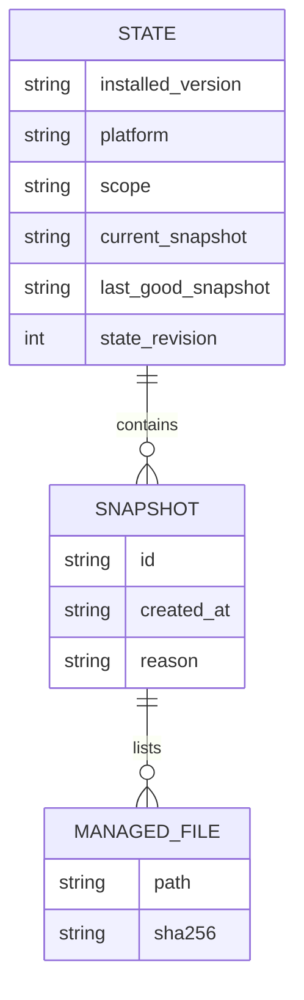
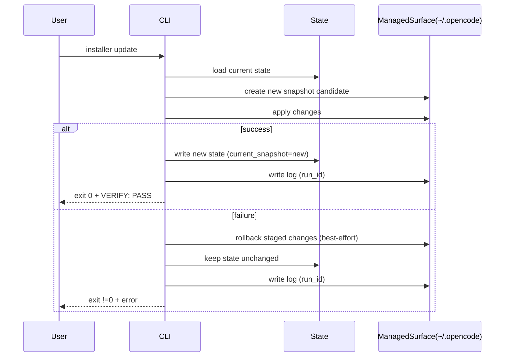

# DESIGN: Installer MVP

<!--
SOURCES
- mvp/DOD.md
- mvp/BACKLOG_V2.md
-->

---

## 1. Goals & Non-Goals

### Goals (MVP)
- Stable CLI contract on Linux/macOS: `doctor`, `install`, `update`, `rollback`, `uninstall`.
- Versioned JSON output contract for `doctor --json` (fixed `output_version: "1"`).
- Managed-surface default policy: modify only within `~/.opencode/`.
- Safe state persistence, snapshots, rollback/uninstall limited to managed surface.
- Persistent logs under managed surface with `run_id` correlation.
- Windows MVP: PowerShell `.ps1` doctor-only, guiding users to WSL2.

### Non-Goals (MVP)
- Full Windows installation support (outside WSL2).
- Editing `.zshrc`, `.bashrc` by default.
- Creating project-root `.env` or `.utcp_config.json` by default.

---

## 2. Managed Surface Model

### Managed scope
- **Default**: `~/.opencode/`
- Installer MUST emit a clear statement in help/docs indicating managed surface and non-goals.

### Paths inside managed surface (proposed)
- `~/.opencode/installer/state.json` (or equivalent)
- `~/.opencode/installer/snapshots/`
- `~/.opencode/installer/logs/`

> NOTE: exact file names are implementation details; the design requires they live under `~/.opencode/`.

---

## 3. CLI Contract

### Commands
- `doctor`
- `install`
- `update`
- `rollback`
- `uninstall`

### Minimum flags
- `--config`
- `--non-interactive`
- `--dry-run`
- `--json`
- `--verbose`

### Config behavior
- If `--config` points to a missing file ⇒ exit != 0 and a clear message (DoD-07).

---

## 4. JSON Output Schema (doctor --json)

### Schema intent
Provide a stable, machine-readable contract for tooling and automation. The schema must be versioned.

**Required:**
- `output_version: "1"`
- `platform`
- `scope` (project/global)
- `installed_version`
- `state_revision` (or equivalent)
- `snapshots[]`
- `managed_files[]` with `path` and `sha256`
- `run_id`

> Field names beyond `output_version` are constrained by DoD acceptance statements; keep them stable once published.

---

## 5. State & Snapshots

### State document
State must be persisted under `~/.opencode/` and include:
- `installed_version`
- `platform`
- timestamps
- `snapshots[]`
- `last_good_snapshot`
- `current_snapshot`

### Snapshot contents
- Snapshot metadata: `id`, timestamp, reason (install/update)
- Snapshot manifest:
  - `managed_files[]` each with `path` + `sha256` (DoD-27)

### Transactional model
- `update` and `rollback` must not leave partial state.
- If an operation fails:
  - state MUST remain pointing at `last_good_snapshot` / unchanged `current_snapshot`.

---

## 6. Logs & Correlation

- Logs must be written under `~/.opencode/` and the CLI output must print the log path (DoD-29).
- Each execution has a `run_id` that appears in:
  - console output
  - the persisted log file

---

## 7. Windows MVP (doctor-only)

- Deliverable: `installer.ps1`
- Supported command: `doctor`
- Any attempt to run `install` MUST fail with a clear message “Windows: doctor-only; use WSL2”.

---

## 8. Mermaid Diagrams

### 8.1 High-level Architecture

```mermaid
flowchart TD
  CLI[Installer CLI\n(Linux/macOS binary)] --> CMD{Command}
  CMD -->|doctor| DOCTOR[Doctor checks\n+ JSON output]
  CMD -->|install/update/rollback/uninstall| OPS[Ops Engine]

  DOCTOR --> STATE[State Reader\n~/.opencode/...]
  OPS --> STATE

  OPS --> SNAP[Snapshots\n~/.opencode/.../snapshots]
  OPS --> LOGS[Logs\n~/.opencode/.../logs]

  PS[installer.ps1\n(Windows doctor-only)] -->|doctor| DOCTOR
```

### 8.2 State / Snapshot Relationship



### 8.3 Transactional Update Flow (simplified)



---

## 9. Open Questions (must stay explicit)

- Installer implementation language and packaging mechanism are **UNKNOWN** in this documentation-only step.
- Exact directory layout for source code is **UNKNOWN** until stack choice.
